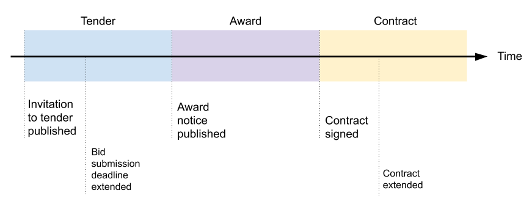
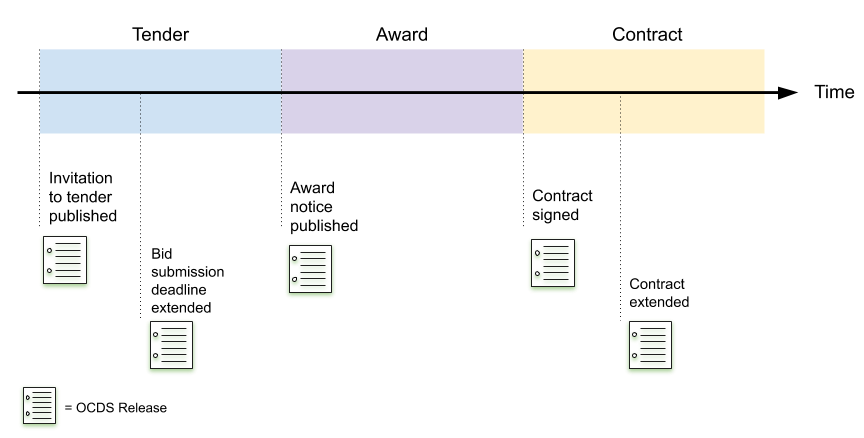
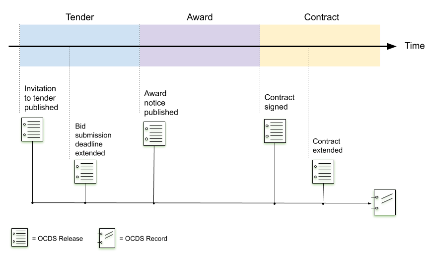
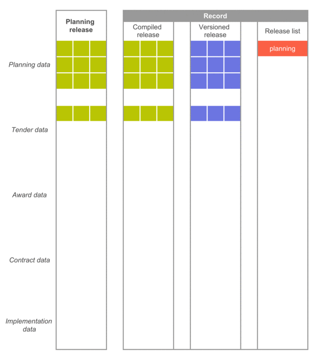

# Releases and Records

Tracking change over time is important for users of contracting data.

Publishers are encouraged to publish data in near real-time and to provide a change history. The OCDS releases and records model describes how to do this.

## The Releases and Records model

Releases and records are the two JSON document formats supported by OCDS.

Consider the timeline of a contracting process. OCDS identifies five main stages but there can be many events within each stage. The image below shows an example timeline for a contracting process.



There are major events that mark the progress from one stage to another, like an award notice. Smaller events take place within a stage, like a deadline extension for bidding. In OCDS, all changes are disclosed using **releases**. Releases are JSON documents, published each time there is an update in the process.



Releases are **immutable**. Each change is documented in a **new** release, rather than by updating an existing one. The collection of releases for a particular process makes its change history.

**Records** are JSON documents that act as an index of all releases for a single contracting process. While releases are never updated, records are updated each time there is a change. A record is updated by adding a new release to this index.



Records can also contain:

* A *compiled release*, which uses the same structure as an OCDS release. It represents the latest state of each field.
* A *versioned release*, that contains a history of changes for each individual field.

These structures are designed to help users to access:

* The current state of the contracting process 
* The detailed history of changes for individual fields

In accounting terms, releases are analogous to individual transactions in an account. A record represents both the ledger of all transactions and the closing balance. The ledger is the releases list, and the closing balance is the compiled release.

In software development terms, releases are analogous to Git commits on a branch. A record represents both the commit history for the branch and the HEAD for the branch. The releases list is the commit history, and the HEAD is the compiled release.

### Releases

Releases follow the [release schema](../schema/reference). The schema covers the whole contracting process, but there are only a few mandatory fields. The box below shows an example.

```{eval-rst}
.. jsoninclude:: ../examples/tender.json
   :jsonpointer: /releases
   :expand: 
   :title: release
```

#### Identifiers

Each release contains an [ocid](../../schema/identifiers/#contracting-process-identifier-ocid) to identify the contracting process it relates to. An ocid is composed of a prefix and an unique process identifier chosen by the publisher.

A release also needs a release identifier, unique in the scope of the contracting process. A release id can be built in several ways. Publishers can use any generation strategy, as long as the ids don’t collide within the same process.

The [easy releases](../guidance/build/easy_releases) section introduces two strategies that can be used in any scenario. 

#### Packaging

Releases are wrapped in a release package to provide context to the data. The `uri` package field contains a URI to an online copy of the same release package.

See the [Release Package schema](../schema/release_package) for details.

#### Tags

Each release also provides one or more tags. Tags provide information about the event the release relates to.

For example:

* When an invitation to tender is published, the publisher uses the 'tender' tag . The release includes the relevant details in the `tender` section. It can also contain information about the budget in the planning section.
* When a contract is awarded, the publisher uses the 'award' tag. The release includes the relevant details in the `award` section. It can also update the tender section with the list of tenderers that submitted a bid. 

The [release tag codelist](../../schema/codelists/#release-tag) contains the list of all tags provided by OCDS. Note that it is allowed to use more than one tag in the same release. For example, a release with new data in the `tender` and `award` sections can use the 'tender' and 'award' tags together.

#### Repeating previous information

Releases can repeat unchanged data from previous releases, or include new information only. Publishers decide how much data to include as long as mandatory fields are present.

It might be more appropriate to repeat data when processes have fewer releases. Consider as well that repeating previous information makes larger releases and larger datasets.

<div class="example hint" markdown=1>

<p class="first admonition-title">Example</p>

The following example shows releases with minimal changes on each update. 

1. The first release presents tender data. 

2. The second introduces a new document in the `tender` section with the 'tenderUpdate' tag. Note that the release ignores all the nonmandatory fields. The tender document present in the previous release is also ignored.

3. The third release presents award data, and ignores the tender section.

 ```{eval-rst}
.. jsoninclude:: ../examples/minimal_updates/tender.json
   :jsonpointer: /releases/0
   :expand: tender
 ```

```{eval-rst}
.. jsoninclude:: ../examples/minimal_updates/tenderUpdate.json
   :jsonpointer: /releases/0
   :expand: tender
```

```{eval-rst}
.. jsoninclude:: ../examples/minimal_updates/award.json
   :jsonpointer: /releases/0
   :expand: award
```

</div>

### Records

A record follows the structure defined in the [Records Reference](../schema/records_reference). Below is a full example.

```{eval-rst}
.. jsoninclude:: ../examples/merging/versioned.json
   :jsonpointer: /records/0
   :expand: 
```

#### Embedding or linking Releases

Records contain the history of a contracting process as a list of releases, by either embedding or linkint to the releases.

See the [Record reference](../schema/records_reference) for more details.

#### Compiled and Versioned Releases

A **compiled release** follows the release structure. It contains the latest value for all fields present in the releases of a process. The example above shows how a compiled release looks. It is encouraged to include a compiled release when producing records.

A **versioned release** follows a similar structure. For each field in the release structure, the versioned release provides an object. This object contains the history of changes for the field.

Each time a new release is available:

* The record adds the new release to the releases list, by either embedding it or adding a link to it.
* The record updates the compiled and versioned releases using the new information. Repeating unchanged information does not affect the result.

<div class="example hint" markdown=1>

<p class="first admonition-title">Hint</p>

Compiled releases are not mandatory, but it helps to make OCDS data more accessible, especially for users that don’t need a detailed change history.

Consider how to calculate the **total value of active tenders** using compiled releases:

```{eval-rst}
.. csv-table-no-translate::
    :header-rows: 1
    :file: ../examples/compiledreleases_compiled.csv
```

Working with compiled releases, this metric can be calculated by filtering on the tender status and summing the tender value.

Compare that to how to calculate the **total value of active tenders** using releases:

```{eval-rst}
.. csv-table-no-translate::
    :header-rows: 1
    :file: ../examples/compiledreleases_releases.csv
```

If a user has releases only, they need to first determine the final status before calculating the result.

Compiled releases are useful for many scenarios. But users might need the full history to answer other questions. For example, how many amends there are for a tender's value.

</div>

#### Packaging

Records are published wrapped in a record package. The `uri` field in the package leads to a copy of the same record package.

#### How does all fit together?

The following shows how to update a record as releases are published over time.

