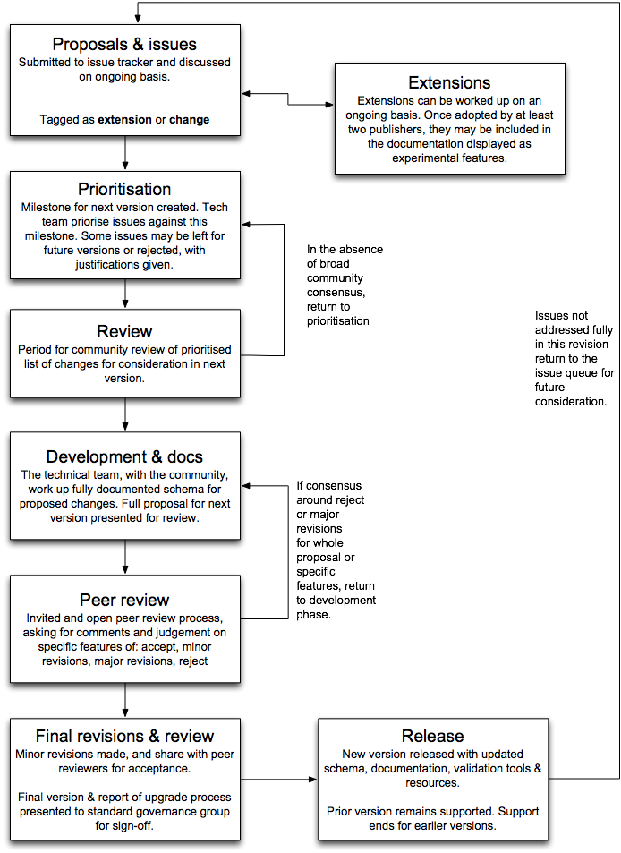

# Governance

The Open Contracting Data Standard (OCDS) has many stakeholders: governments (procuring entities, monitoring & oversight authorities, project managers and policy makers), the private sector, and civil society organizations. The needs and interests of these stakeholders, as publishers and users of the data, are varied. As OCDS develops over time, with updated versions and new features, it is important that a diverse group of stakeholders are engaged in the process.

This document sets out the revision processes for OCDS.

## Stewardship and governance

The [Open Contracting Partnership (OCP)](http://www.open-contracting.org) was established as an independent non-profit in early 2015 and acts as the lead steward of the Open Contracting Data Standard. 

OCP is led by an executive director, and is supported by a multi-stakeholder advisory board with representation from governments, multilateral organizations, academia, NGOs and business. 

As of February 2016, OCP is fiscally hosted by the [Fund for the City of New York](https://www.fcny.org/fcny/) (FCNY). Under the terms of this agreement, Intellectual Property is held by FCNY on behalf of OCP, but will transfer to any future legal entity hosting OCP. 

In the pursuit of a consensus and **community-driven process**, subscribers to the [standard-discuss@open-contracting.org](https://groups.google.com/a/open-contracting.org/forum/#!forum/standard-discuss) discussion list (join by sending an email to <a href="mailto:standard-discuss+subscribe@open-contracting.org">standard-discuss+subscribe@open-contracting.org</a>) and those watching and engaging with the [standard GitHub repository](https://github.com/open-contracting/standard) should be kept informed at all stages about planned revisions to OCDS, and should be offered clear and timely opportunities to input and comment.

To ensure the relevance, quality and effective implementation of proposed updates to the standard, new version releases are subjected to a process of **peer review** with invited reviewers from publisher and user communities, and an open review process. 

A lightweight **standard governance working group**, made up of representatives from OCP staff, the multi-stakeholder advisory board, and the standard development team will be responsible for giving final approval to formal upgrades of the standard and ensuring the processes in this document have been properly carried out.

In the future, the Open Contracting Data Standard may be submitted to a formal standardization body, such as the World Wide Web Consortium, or OASIS. Before such a decision is made, a model of community-driven governance must be established based on an open and consensus-based processes for updating the standard.

### Intellectual property

The Open Contracting Data Standard is the Intellectual Property of the Open Contracting Partnership. The schema is licensed under the **[Apache 2.0 License](http://www.apache.org/licenses/LICENSE-2.0)** license, with accompanying documentation under a **[Creative Commons Attribution 4.0 International license](https://creativecommons.org/licenses/by/4.0/)** where stated. 

Contributors to the standard agree to transfer any copyright in their contributions to the Open Contracting Partnership (via its fiscal sponsor) through a contributor agreement process, in order that those contributions are held in trust as part of the standard.

No content infringing upon third-party Intellectual Property Rights will be included in the standard. 

## Governance principles

We are committed to the [Open Stand principles](https://open-stand.org/about-us/principles/) for standards development. The Open Contracting Data Standard will be developed with:

* **Due process.** Decisions made with equity and fairness among participants. Through an open process for submitting issues, extensions and requests for updates, no one party will dominate or guide standard development. All processes will be transparent and opportunities will exist to appeal decisions. Processes for periodic standards review and updating are well defined in this document.

* **Broad consensus.** The process will allow for all views to be considered and addressed, such that agreement can be found across a range of interests.

* **Transparency.** We will provide advance public notice of proposed standards development activities, the scope of work to be undertaken, and conditions for participation. Easily accessible records of decisions and the materials used in reaching those decisions will be provided. Public comment periods will be provided before final standards approval and adoption.

* **Balance.** Standards activities will not exclusively dominated by any particular person, company or interest group.

* **Openness.** The Open Contracting Data Standard processes are open to all interested and informed parties.

## Versioning and upgrade process

Over time, changes will be needed to the standard, including addition of new codes and fields, and occasionally involving changes to existing fields and structures. 

The revision process is designed to ensure:

* The consequences of any change for different stakeholders are identified and considered;

* It is clear why changes are needed, and that there is broad support for any proposed changes;

* Changes are easy to identify and are transparent, and publishers, users and intermediaries have clear documentation to allow them to update their data and tools;

Changes to the OCDS schema will be made periodically, with the version number of the standard incremented to indicate that changes have been made, and a changelog maintained.

This documentation website is composed of normative content (the prescriptive part of OCDS) and non-normative content (the non-prescriptive, or ‘descriptive’, part of OCDS) as defined and described in the [Normative and non-normative content and changes policy](https://docs.google.com/document/d/1xjlAneqgewZvHh6_hwuQ98hbjxRcA2IUqOTJiNGcOf8/edit). This policy establishes which changes to which parts of the documentation must involve the revision process described below (e.g. adding new fields to the release schema), and which changes may be made without the revision process (e.g. correcting typos in field descriptions, or updating implementation guidance).

### Versions

Distinct **branches** of the standard will be maintained within GitHub for each version. 

Branches can be in one of two states:

* **Development** - indicated by a -dev suffix (e.g. 1.1-dev)
Both schema and documentation on a development branch may be updated and should be implemented on an experimental basis.

* **Live** - with no suffix ( e.g. 1.0)
Only documentation may be updated on a live branch. All documentation changes must be reviewed to ensure they do not make any changes to the meaning of the standard. 

Semantic Versioning practices will be used to distinguish between:

* **Major versions** which make backwards-incompatible changes (e.g. 2.0)

* **Minor versions** which add functionality in a backwards-compatible manner (e.g. 1.2)

These are captured by a version number in the format MAJOR.MINOR

## Revision process

To release a new minor or major version upgrade will involve a number of stages outlined in the flowchart below, and described in more depth in the following sections. 



**General principles:**

* **Publicity:** All stages of the revision process will be announced via the standard-discuss mailing list, and through GitHub issues. These are the formal channels for notification during the process.

* **Consensus:** All processes will aim towards gaining community consensus for changes. 

The standard development team is responsible for generating key documentation during the process, but should be guided by community consensus, submitting all decisions for discussion.

* **Appeal:** Any party can appeal against decisions made during the process by writing to the standard governance working group, which can be reached through OCP's Director for Data & Engagement, <a href="mailto:lmarchessault@open-contracting.org">Lindsey Marchessault</a>. The working group has the authority to reject proposed revisions on the standard in response to appeals.

### Proposals

Changes to OCDS can be proposed by anyone at any point via the public, online, [standard issue tracker](https://github.com/open-contracting/standard/issues) either as issues for discussion, or pull requests with a clear description of the proposed change.

Contributors are encouraged to raise discussions prior to pull requests to seek consensus on proposed changes.

Changes can be proposed as:

* **Extensions** - which add new features to the standard.

* **Changes** - such as updated field definitions or codelist entries. 

If there are at least two parties interested in using an extension, and following discussion of the extension draft, then it may be displayed in the current version of the documentation as an ‘experimental feature’. 

### Prioritization

The standard development team, with reference to community views, identify change proposals and extensions which ought to be considered for adoption in the next version of the standard, assigning these to milestones in the issue tracker where they are open for discussion.

Periodically, at the start of a revision process a cut-off date for proposals will be announced  with at least two weeks notice. After that date a prioritized list of updates is produced. Any new proposed extensions or changes received after this period may not be considered until the next prioritization phase. 

### Prioritization review

The list is shared for feedback, with at least a two-week window for discussion.

Based on discussions, a final list is then proposed by the OCP's Head of Data Products & Services with all the issues that will be taken forward into the rest of the process. A proposal that has made it this far might or might not make it into the final upgrade. As the proposal is worked into final concrete examples and schema changes further issues can arise.

### Development

The standard development team, working with community members, will work on a development branch to prepare updates to the schema, documentation and codelists, according to the prioritized list.

This stage is likely to involve broad community engagement and discussion of specific decisions through GitHub issues. 

At the point where all open issues are suitably addressed, the development branch is ready to be submitted for peer review.

### Peer-review

The updated schema, documentation along with a changelog and narrative description of the changes will be released for peer-review.

A group of invited reviewers, representing different stakeholders, and including data publishers and users, will be asked to complete a full review of the changes, and to submit:

* A judgment on whether the overall upgrade, and/or specific changes ought to be **accepted**, **accepted with minor changes**, **substantially revised**, or **rejected**.

* Comments on each request for revisions or rejection.

All reviews, with reviewer names, will be published. Community members can also submit their own reviews of the whole revision, or specific elements. The minimum period for peer-review is one month. 

### Revisions

The standard development team, with reference to the working group as appropriate, evaluates reviews, and decides whether the whole upgrade, or specific features thereof, need to be revised, rejected or postponed to future processes.

If only minor changes are suggested, then the revised standard should be submitted back to reviewers for a brief review period of at least two weeks.

If major changes are needed, then a longer follow up review process of at least one month should be allowed for.

### Release

Once all reviewer comments have been addressed to the satisfaction of the reviewer in question, then the updated version of the standard must be submitted to the **standard governance working group** for final approval, along with a short report of the process. 

Following **working group** approval, the revision branch may be set to live. 

## Deprecation policy 

If a term (a definition or field) is scheduled to be renamed or removed from the specification as a result of the revision process, the next minor release of the specification must [deprecate](https://en.wikipedia.org/wiki/Deprecation) the term within the schema, and the following major release must rename or remove the term from the schema, making the term obsolete. Implementations may use deprecated terms, but will receive warnings from the OCDS Data Review Tool described below. Implementations may not use obsolete terms, and will receive errors from the OCDS Data Review Tool.

## Translation and localization policy

The standard is translated and localized in line with the [latest version of the translation and localization policy](https://docs.google.com/document/d/1GLwWTpgDDkKmMr1hZE4D75LI8VQtFiD0VA7TF_FvY_Q/view). 

## Support policy

Support will be offered for one prior version of the standard. Support for any earlier versions than this will be ended when a new version is released. 

For example, when 1.1 is the latest release, 1.0 will be supported in the OCDS Data Review Tool and other tooling. When 1.2 is released, support for 1.0 will end.

Publishers are encouraged to review each new version when it is released, and to consider how they might adopt new features.

Publishers should aim to move to a new **major** version within 18 months of its release. 

## Definitions

**Stakeholder**

Any current or potential OCDS publisher or data user of the standard can be considered a stakeholder. When engaging with stakeholders, attention ought to be paid to representation of both publishers and users; representation of public and private sectors and civil society; and broad geographical representation.

**Consensus**

"The principle of consensus has its origins in the desire to achieve the general acceptance and application of a Standard within its intended sphere of influence. This entails trying to ensure that the interests of all those likely to be affected by it are taken into account, and that individual concerns are carefully and fairly balanced against the wider public interest." [BSI, 2012](http://www.bsigroup.com/Documents/about-bsi/NSB/BSI-pocket-guide-to-standards-development-UK-EN.pdf) 

```{eval-rst}
.. toctree::
   :hidden:

   deprecation
```
