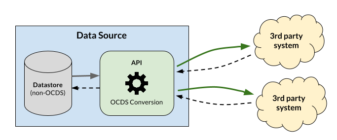

```{workedexample} Individual releases with no change history
:tags: release
```

# Individual releases with no change history

This page explains how to publish individual releases in the case that you cannot publish a change history as described in the [change history implementation options](change_history_options.md).

To publish individual releases, you need to be able to determine what changed and when within your data sources so that you can update the release `id` each time there is a change to a process. Updating the release `.id` for each change means that users can periodically download the data and use the release `id` to identify changes.

The examples on this page illustrate two possible approaches to setting and updating release `id` in the absence of a change history:

* **Last modified dates** - When a data source stores a last modified date, use it to create a unique release `id`. For example, by appending the last modified date to the `ocid`.
* **Hashing** - When a data source does not store a last modified date, use a hash of all the data elements to create a unique release `id`. A hash is guaranteed to change when the data changes and is (almost) guaranteed not to collide with a previous identifiers from the same contracting (or planning) process.

## Additional Considerations

### Packaging

Releases in OCDS need to be packaged using in [release package](../../schema/packaging/release_package.md). It is *not* appropriate to package releases in an OCDS record, because `record.releases` needs to contain all the releases, not only the latest one.

### Release tags

[Release tags](../../schema/codelists.md#release-tag) indicate whether a release describes a planning process or a contracting process and, for contracting processes, indicate the stage of the process to which the release relates.

Some release tags rely on the availability of prior releases. For example, the 'tenderUpdate' tag indicates that a release updates an existing 'tender' release. Such tags cannot be used when publishing individual releases with no change history, because the previous releases are inaccessible. 

Instead, you ought to use the `tag` field to indicate the sections of the schema which are populated. For example, if a release includes fields in the `tender`, `award`, and `contract` sections, `tag` ought to be populated as follows:

```json
{
    "tag": [
      "tender",
      "award",
      "contract"
    ]
}
```

When publishing individual releases with no change history, from a user's perspective, each release is always the first (available) release for a given contracting (or planning) process. Therefore, all of the populated sections in the release contain 'new' data, in line with the meaning of the 'planning', 'tender', 'award', 'contract' and 'implementation' release tags.

## Worked examples

The following examples are based on a system architecture in which data is extracted and transformed on demand, and the resulting OCDS releases are not stored by the publisher.



### Last modified date

This example shows how to set and update the release `.id` when a data source stores a last modified date.

The data source for an OCDS implementation is a procurement database. The database includes a `tender_processes` table with the following columns:

* `tender_id` (primary key)
* `title`
* `tender_value`
* `tender_currency`
* `last_modified`

Each row in the table represents a contracting process, `tender_id` is a unique identifier for the contracting process, and `last_modified` stores the date and time of the last modification to the row.

#### Tender

A buyer adds an opportunity for the purchase of office supplies to the database.

```{csv-table-no-translate}
:header-rows: 1
:widths: auto
:file: ../../examples/no_change_history/individual_releases/last_modified_date/tender.csv
```

The OCDS implementation provides access to a release describing the opportunity. It sets:

* `ocid` to the publisher's ocid prefx ('ocds-213czf') plus the `tender_id`, creating a globally unique identifier for the contracting process.
* `id` to the `last_modified` date, creating a release identifier that will change with each update to the contracting process.
* `date` to the `last_modified` date.

```{jsoninclude} ../../examples/no_change_history/individual_releases/last_modified_date/tender.json
:jsonpointer: /releases/0
:expand: tender, tag, value
```

#### Tender update

The buyer increases the estimated value of the opportunity. The `tender_value` and `last_modified` fields in the database record are updated accordingly.

```{csv-table-no-translate}
:header-rows: 1
:widths: auto
:file: ../../examples/no_change_history/individual_releases/last_modified_date/tender_update.csv
```

The OCDS release describing the contracting process is also updated. The values of the `id`, `date` and `tender.value.amount` fields are updated. Note that the value of the `tag` is not updated, in accordance with the [guidance on release tags](#release-tags).

```{jsoninclude} ../../examples/no_change_history/individual_releases/last_modified_date/tender_update.json
:jsonpointer: /releases/0
:expand: tender, tag, value
```

### Hashing

This example shows how to use [hashing](https://en.wikipedia.org/wiki/Hash_function) to set and update the release `.id` when the data source does not store a last modified date.

The data source for an OCDS implementation is a procurement database. The database includes a `tender_processes` table with the following columns:

* `tender_id` (primary key)
* `title`
* `tender_value`
* `tender_currency`

Each row in the table represents a contracting process and `tender_id` is a unique identifier for the contracting process. Unlike the previous example, the data source does not store a last modified date.

#### Tender

A buyer adds an opportunity for the purchase of office supplies to the database.

```{csv-table-no-translate}
:header-rows: 1
:widths: auto
:file: ../../examples/no_change_history/individual_releases/hashing/tender.csv
```

The OCDS implementation provides access to a release describing the opportunity. It sets `ocid` to the publisher's ocid prefx ('ocds-213czf') plus the `tender_id`, creating a globally unique identifier for the contracting process.

In the absence of a last modified date, the implementation generates a unique release `id` by combining the values of all the data elements in the data source and applying a hash function. For example, in PostgreSQL:

```sql
SELECT
  md5(CAST((tender_processes.*)AS text))
FROM
  tender_processes
WHERE
  tender_processes.tender_id = 1;
```

The result of the hash calculation is `69a19ab9713d08bc7c54793144997d3a`. In the absence of a last modified date, the `date` field is set to the date that the release was generated.

```{jsoninclude} ../../examples/no_change_history/individual_releases/hashing/tender.json
:jsonpointer: /releases/0
:expand: tender, tag, value
```

```{admonition} Data sources with multiple tables
  In order for the release `id` to change with each update to the contracting process, it is necessary to include *all* data elements that are included in the OCDS data in the hash calculation, even if they are stored in different tables.
```

#### Tender update

The buyer increases the estimated value of the opportunity. The `tender_value` in the database record is updated accordingly.

```{csv-table-no-translate}
:header-rows: 1
:widths: auto
:file: ../../examples/no_change_history/individual_releases/hashing/tender_update.csv
```

The OCDS release describing the contracting process is also updated. The values of the `id`, `date` and `tender.value.amount` fields are updated. The same hash function is applied to the updated data elements resulting in new `id` value. Note that the value of the `tag` is not updated, in accordance with the [guidance on release tags](#release-tags).

```{jsoninclude} ../../examples/no_change_history/individual_releases/hashing/tender_update.json
:jsonpointer: /releases/0
:expand: tender, tag, value
```
