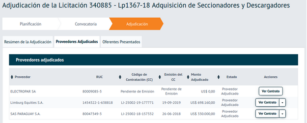

# Awards and contracts

Contracting processes can take many forms and follow many different types of procedure, from a simple contracting process resulting in a single contract between a buyer and supplier, to a multi-buyer, multi-supplier framework agreement implemented as an electronic catalog.

OCDS defines a common model for disclosing structured data on public contracting processes carried out in any jurisdiction, including data on awards and contracts. The examples in this guidance explain how to model awards and contracts occurring in different types of contracting processes using OCDS.

## Definitions

In order to understand the modelling examples, it’s important to first clarify the definitions of some key concepts.

### Award

In OCDS, the `Award` object is intended to communicate a direct relationship between items, suppliers, and values. It ought to be possible to know, at the award stage, in OCDS data, which items will later be supplied by which suppliers, and what the value of those contracts will be.

```{note}
The OCDS schema and documentation are not clear what, precisely, is meant by 'award'. A revision of the definition of `Award` in OCDS is being considered for a future version of the standard ([GitHub issue](https://github.com/open-contracting/standard/issues/895)).
```

### Contract

Contracting processes can result in different types of contract between buyers and suppliers, which can include:

* A contract establishing the relationship, like the set-up of a framework agreement
* A contract within the relationship, like a call-off contract under a framework agreement
* Purchase orders
* Catalog purchases

In OCDS, the `Contract` object is intended to communicate a legally binding agreement between a buyer and suppliers to provide items. This excludes agreements to set-up a structure through which contracts are later awarded to provide items, for example: a contract to set up or add suppliers to a framework agreement or dynamic purchasing system.

```{note}
The OCDS schema and documentation are not clear what, precisely, is meant by 'contract'. A revision of the definition of `Contract` is being considered for a future version of the standard ([GitHub issue](https://github.com/open-contracting/standard/issues/896)).
```

## Awards and contracts

In OCDS, **awards** and **contracts** are modelled as separate stages of the contracting process. This approach allows for the possibility that an award is made but a contract is never entered into. The model also allows for the possibility that there is a difference between the award and the signed contract, either in value, duration, items or otherwise. While such differences might be illegal in some jurisdictions, they can occur in some cases and are therefore possible in OCDS. Source systems can contain data on awards, on contracts, or on both.

<div style="width:100%">

<div class="process-table">


**Planning**<br/>

</div>

<div class="process-table">


**Initiation (Tender)**<br/>

</div>

<div class="process-table">


**Award**<br/>

</div>

<div class="process-table">


**Contract**<br/>

</div>

<div class="process-table">


**Implementation**<br/>

</div>

</div>
<br clear="all"/>

Each contracting process can have many awards and each award can have many related contracts.

OCDS separates data about the contract award and data about the signed contract into the `awards` and `contracts` sections respectively. `Award` objects (within `awards`) and `Contract` objects (within `contracts`) are connected by setting `awards.id` and `contracts.awardID` to the same value. Source systems can contain data on awards, on contracts, or on both.

If the data in the source systems relates to: 
* both awards and contracts, then both `awards` and `contracts` ought to be populated. 
* only awards, then only `awards` ought to be populated.
* only contracts, then `contracts`, `awards.id`, and `awards.suppliers` ought to be populated.  

If the contract (e.g. its value, period or items) is subsequently updated or amended, update only the corresponding fields in `contracts`. The fields in `awards` stay the same. 

### Example: Changes between award and contract

The Zambia Public Procurement Authority provides a central e-procurement system, used by procuring entities to manage the tender and award stages of the contracting processes, which publishes OCDS data.

Once an award is published by the e-procurement system, there is a 10-day standstill period for unsuccessful bidders to appeal the award decision.

If an appeal is made and upheld, then the award is cancelled. If no appeals are upheld by the end of the standstill period, then a contract is signed between the buyer and the supplier, outside of the e-procurement system. No OCDS data is published or updated from this stage of the contracting process onward.

In this example, the Ministry of Finance uses the e-procurement system to solicit bids for the development of a new website. A contract is awarded to 360nx Designs for 3,000,000 ZMK, through the e-procurement system.

An unsuccessful bidder appeals the award decision and the appeal is upheld, resulting the award being cancelled.

If both the `award` and `contract` sections of OCDS had been populated when the award was made through the e-procurement system, this would have resulted in the presence of a contract in the OCDS data that had never existed in reality.

## Awards and award notices

Award notices are used by buyers and procuring entities to disclose award decisions, i.e. the value and/or items awarded to each supplier.

A single award notice can be used to disclose many award decisions; however in order for an award in OCDS to communicate a direct relationship between the items being purchased, the supplier providing the items, and the value of the items, such notices ought to be split into multiple awards in OCDS.

### Example: Modelling award notices with multiple decisions

In Paraguay, a single award notice is used to disclose many award decisions. Detailed information is provided about each individual award decision; however all decisions on an award notice share the same identifier. For example:



Using a single award object to model such a notice in OCDS would make it impossible to determine which items related to which suppliers or how much of the total award value related to each supplier:

```{csv-table-no-translate}
:header-rows: 1
:widths: auto
:file: ../../examples/award_decisions/single_award.csv
```

For the award object in OCDS to communicate a direct relationship between items, suppliers, and values, Paraguay's award notice is split into multiple award objects, one for each supplier/value pairing on the notice.

```{csv-table-no-translate}
:header-rows: 1
:widths: auto
:file: ../../examples/award_decisions/multi_award.csv
```

There are no identifiers for the individual supplier/value pairings on the original award notice, so it is necessary to create a new identifier for each award object in OCDS. The approach to creating an identifier will depend on the properties of the dataset; for example, in Paraguay a combination of the award notice identifier, supplier name, and a consecutive number is used.

```{csv-table-no-translate}
:header-rows: 1
:widths: auto
:file: ../../examples/award_decisions/identifiers.csv
```

```{admonition} View the example in JSON
:class: tip

[View the example in Paraguay’s API](https://contrataciones.gov.py/datos/api/v3/doc/ocds/record/ocds-03ad3f-340885-1)
```
## Purchase orders

A purchase order is a specific type of contract, an official document issued by a buyer committing to pay a supplier for the supply of specific goods, works or services to be delivered in the future.

Purchase orders can be issued against an existing contract, or if no prior contract exists then acceptance of a purchase order by a supplier forms a contract between buyer and supplier.

Purchase orders that are made against contracts with a definite quantity or value of items ought to not be disclosed in the `contracts` section of OCDS, due to the risk of double counting items on the purchase order and the contract it relates to.

### Example: Double counting contracts and purchase orders

The UK's Department for Transport awards a £1.2m, 12-month contract to KPMG to provide the Project Management Office function for a project to construct a new highway bypass. The contract specifies that payment will be made quarterly in arrears in four equal amounts. The contract is represented in the `contracts` section of OCDS as follows:

```{csv-table-no-translate}
:header-rows: 1
:widths: auto
:file: ../../examples/purchase_orders/parent_contract.csv
```

Calculating the sum of the contract value in the above example gives the correct result of £1.2m.

The Department for Transport issues a purchase order on the final day of each quarter of the contract term, each for £300k.

If purchase orders were also disclosed in the `contracts` section of OCDS, by the end of the contract term, the `contracts` section of OCDS would be populated as follows:

```{csv-table-no-translate}
:header-rows: 1
:widths: auto
:file: ../../examples/purchase_orders/contracts_pos.csv
```

Calculating the sum of the contract value in the above example gives an incorrect result of £2.4m - double the actual value of the contract.

```{note}
The approach for modelling purchase orders in OCDS is under discussion ([GitHub issue](https://github.com/open-contracting/standard/issues/897))
```
