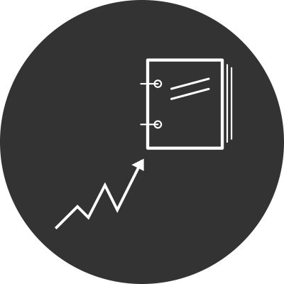
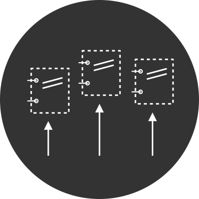

# Awards, contracts, buyers and suppliers

Contracting processes can take many forms and follow many different types of procedure, from a simple contracting process resulting in a single contract between a buyer and supplier, to a multi-buyer, multi-supplier framework agreement implemented as an electronic catalog.

The examples in this guidance explain how to model awards, contracts, buyers and suppliers occurring in different types of contracting processes using OCDS.

## Definitions

In order to understand the modelling examples, it’s important to first clarify the definitions of some key concepts.

### Award

The [UNCITRAL Model Law on Public Procurement (2011)](https://uncitral.un.org/en/texts/procurement/modellaw/public_procurement) was developed through extensive consultations with governments and interested international organizations and therefore reflects the procurement practices and concepts used in many different jurisdictions. The  [UNCITRAL glossary](http://www.uncitral.org/pdf/english/texts/procurem/ml-procurement-2011/Glossary-e.pdf) defines the "Award of a procurement contract or framework agreement" as:

> *A final stage of the procurement proceedings regulated by the Model Law, resulting in the conclusion and entry into force of a procurement contract or framework agreement between the procuring entity and selected supplier(s) or contractor(s).*

In OCDS, the `Award` object is intended to communicate a direct relationship between items, suppliers, and values. It ought to be possible to know, at the award stage, in OCDS data, which items will later be supplied by which suppliers, and what the value of those contracts will be.

```{eval-rst}
.. admonition:: Note
   :class: note

   .. markdown::

      The OCDS schema and documentation are not clear what, precisely, is meant by 'award'. A revision of the definition of `Award` in OCDS is being considered for a future version of the standard ([GitHub issue](https://github.com/open-contracting/standard/issues/895)).
```

### Contract

Contracting processes can result in different types of contract between buyers and suppliers, which can include:

* A contract establishing the relationship, like the set-up of a framework agreement
* A contract within the relationship, like a call-off contract under a framework agreement
* Purchase orders
* Catalog purchases

In OCDS, the `Contract` object is intended to communicate a legally binding agreement between a buyer and suppliers to provide items. This excludes agreements to set-up a structure through which contracts are later awarded to provide items, for example: a contract to set up or add suppliers to a framework agreement or dynamic purchasing system.

```{eval-rst}
.. admonition:: Note
    :class: note

    .. markdown::

      The OCDS schema and documentation are not clear what, precisely, is meant by 'contract'. A revision of the definition of `Contract` is being considered for a future version of the standard ([GitHub issue](https://github.com/open-contracting/standard/issues/896)).

```

### Buyer

OCDS defines the buyer as:

```{eval-rst}
.. field-description:: ../../../build/current_lang/release-schema.json /properties/buyer
```

```{eval-rst}
.. admonition:: Note
    :class: note

    .. markdown::

      Elsewhere in the OCDS schema the buyer is described as:

      > *The entity managing the procurement. This may be different from the buyer who pays for, **or uses**, the items being procured.*

      There is a proposal to align this description with the above definition.

```

### Suppliers

OCDS defines a supplier as:

```{eval-rst}
.. code-description:: ../../../build/current_lang/codelists/partyRole.csv supplier
```

### Electronic catalog

```{eval-rst}
.. admonition:: Hint
    :class: hint

    .. markdown::

      Electronic catalogs can often be found in more complicated procedures, usually together with framework agreements and involving multiple bidders. However, on their own, they are simply an electronic format (typically prescribed by the buyer) that participants in the contracting process must follow when exchaning information about technical specifications, evaluation criteria, bids, lots, etc. As such, catalogs do not influence the relationship between awards, contracts, buyers and suppliers. 
```

### Purchase order

A purchase order is an official document issued by a buyer committing to pay a supplier for the supply of specific goods, works or services to be delivered in the future.

Purchase orders can be issued against an existing contract, or if no prior contract exists then acceptance of a purchase order by a supplier forms a contract between buyer and supplier.

## The OCDS model

OCDS defines a common model for disclosing structured data on public contracting processes carried out in any jurisdiction, including data on awards, contracts, buyers and suppliers.

### Awards and contracts

In OCDS, **awards** and **contracts** are modelled as separate stages of the contracting process. This approach allows for the possibility that an award is made but a contract is never entered into. The model also allows for the possibility that there is a difference between the award and the signed contract, either in value, duration, items or otherwise. While such differences might be illegal in some jurisdictions, they can occur in some cases and are therefore possible in OCDS. Source systems can contain data on awards, on contracts, or on both.

<style><!--
.process-table { width:18%; float:left; font-size:10pt; }
.process-table p { font-size:10pt; text-align: center; }
.process-table img { width:80%; }
--></style>

<div style="width:100%">

<div class="process-table" markdown=1>



**Planning**<br/>

</div>

<div class="process-table" markdown=1>



**Initiation (Tender)**<br/>

</div>

<div class="process-table" markdown=1>


**Award**<br/>

</div>

<div class="process-table" markdown=1>


**Contract**<br/>

</div>

<div class="process-table" markdown=1>


**Implementation**<br/>

</div>

</div>
<br clear="all"/>

Each contracting process can have many awards and each award can have many related contracts.

### Buyers

In OCDS, the **buyer** is modelled as relating to the contracting process as a whole and each contracting process has only a single `buyer` field, i.e. all awards and contracts resulting from the contracting process share the same buyer.

That said, many organizations can be assigned the 'buyer' role in the `parties` section, making it possible to represent contracting processes with a 'lead' buyer and other buyers.

### Suppliers

**Suppliers** are modelled as relating to awards in OCDS and there can be multiple suppliers per award, i.e. all contracts relating to the same award share the same suppliers.

## Examples

```{eval-rst}
.. toctree::
   :maxdepth: 1

   award_notices_decisions
   mapping_awards_contracts
   consortia
   frameworks
   purchase_orders
   
```
