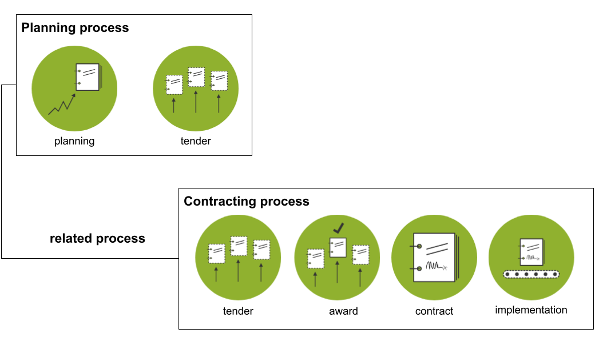

```{workedexample} Contracting processes and planning processes
:tags: planning
```

# Contracting processes and planning processes

OCDS recognizes two types of processes: contracting processes and planning processes. In OCDS, a given process is uniquely identified by an [open contracting process identifier](../../schema/identifiers.md#open-contracting-process-identifier-ocid) (`ocid`). This section helps map your contracting activities (most often procurement procedures) to their OCDS representation.

OCDS defines a contracting process as:

% Align the two blockquotes with the top-level `description` field of the `release-schema.json` file.

> All the actions aimed at implementing one or more contracts. This covers tendering, awarding, contracting and implementation. It does not include actions linked to planning, as these are often less structured and may be linked to multiple contracting processes. In multi-stage procedures (e.g. framework agreements with reopening of competition), each round of competition is treated as a separate contracting process.
>
> Procedures that failed and were restarted are considered new processes.
>
> Boundaries between processes (e.g. whether two contracts result from a single process or from two processes) are set by buyers depending on their needs (e.g. efficient division of labor, clear communication with the market) and legislation (e.g. rules on using procedures and lots).

OCDS defines a planning process as: 

> All the actions aimed at planning one or more contracting processes. This covers, for example, need identification, budget planning, and market research.
>
> Planning processes are often less structured than contracting processes, so one or more planning processes may lead to one or more contracting processes.



A planning process ought to have its `releaseTag` set to 'planning' (or 'planningUpdate'). A contracting process can have `releaseTag` set to [any other value from the codelist](../../schema/codelists.md#release-tag). A planning process should not contain the `releaseTag` 'tender' even if it contains a `tender` object. The two processes ought to be linked together using the `relatedProcesses` array in the releases for the contracting process, with the 'planning' code in the related process' `relationship` array.

```{note}
We recommend publishing data about planning and contracting processes under separate `ocid`s, following the definitions above. That said, publications that combine planning and contracting data under a single `ocid` remain conformant in OCDS 1.2. A required separation can be considered for OCDS 2.0.
```

```{note}
In OCDS 1.2 and earlier, it is not possible to publish all information about multi-stage procedures under a single `ocid`. There is guidance on how to deal with this for [framework agreements](framework_agreements) and for [pre-qualification and pre-selection](pre-qualification). If you want to disclose this type of information (including other types of multi-stage procedures, such as competitive dialogues and innovation partnerships), [contact the OCDS Helpdesk](../../support/index). The approach to modelling multi-stage procedures in a future, backwards-incompatible version of the standard is under discussion on [GitHub](https://github.com/open-contracting/standard/issues/440).
```
