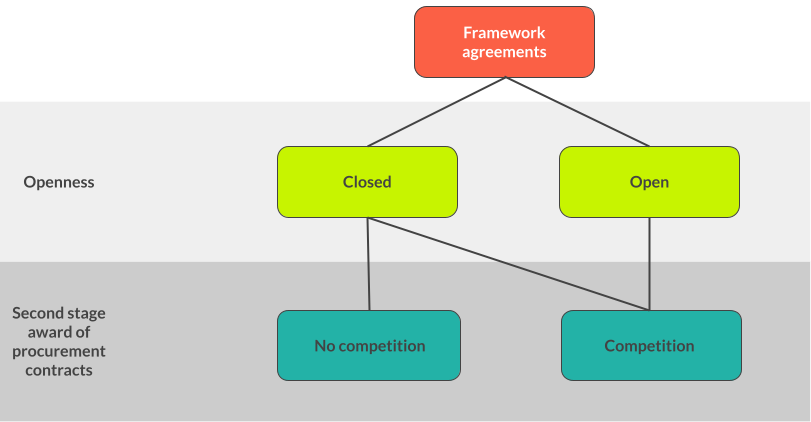
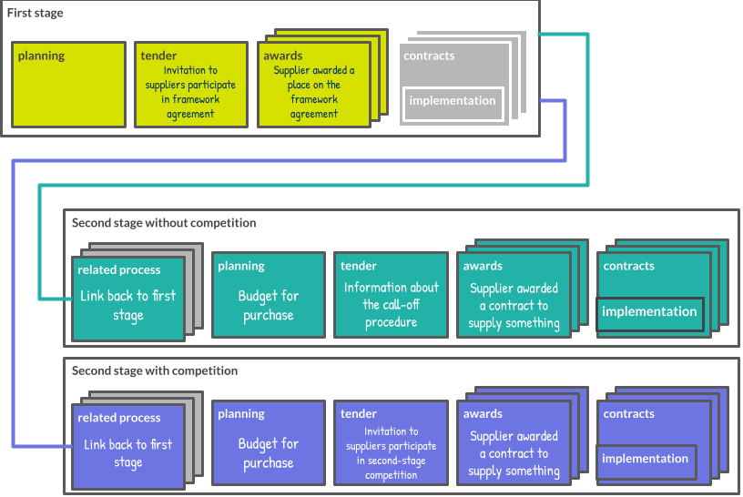

```{workedexample} Framework agreements
:tags: tender,award,contract
```

# Framework agreements

## Definitions

```{note}
In this guidance we defer to the definitions given in the [UNCITRAL Model Law on Public Procurement (2011)](https://uncitral.un.org/en/texts/procurement/modellaw/public_procurement). The model law was developed through extensive consultation and reflects the procurement practices and concepts used in many different jurisdictions.
```

The UNCITRAL model law defines a framework agreement procedure as:

> Procedure conducted in two stages: a first stage to select a supplier (or suppliers) or a contractor (or contractors) to be a party (or parties) to a framework agreement with a procuring entity, and a second stage to award a procurement contract under the framework agreement to a supplier or contractor party to the framework agreement.

In OCDS terms, a framework agreement procedure is a procedure involving at least one framework agreement. A framework agreement is defined in UNCITRAL as:

> Agreement between the procuring entity and the selected supplier (or suppliers) or contractor (or contractors) concluded upon completion of the first stage of the framework agreement procedure.

In OCDS we treat “contractors” and “suppliers” as synonyms. One or more buyers and one or more suppliers can participate in a framework agreement.

A procurement contract is defined in UNCITRAL as:

> Contract concluded between the procuring entity and a supplier  (or suppliers) or a contractor (or contractors) at the end of the procurement proceedings.

## Types of framework agreement



Framework agreements can be **open** or **closed**:

**Closed framework agreement**

> Framework agreement to which no supplier or contractor that is not initially a party to the framework agreement may subsequently become a party.

**Open framework agreement**

> Framework agreement to which a supplier (or suppliers) or a contractor (or contractors) in addition to the initial parties may subsequently become a party or parties.

Procurement systems which provide for closed framework agreements include the EU (Framework Agreements, per Directive 2014/24/EU, Article 33) and the US federal system (Indefinite-delivery contracts, per Federal Acquisition Regulation, Subpart 16.5). An example of a procurement system which provides for open framework agreements is the EU (Dynamic Purchasing Systems, per Directive 2014/24/EU, Article 33).

Framework agreement procedures can involve second-stage competition, or not:

**Framework agreement procedure with second-stage competition**

> Procedure under an open framework agreement or a closed framework agreement with more than one supplier or contractor in which certain terms and conditions of the procurement that cannot be established with sufficient precision when the framework agreement is concluded are to be established or refined through a second-stage competition.

**Framework agreement procedure without second-stage competition**

> Procedure under a closed framework agreement in which all terms and conditions of the procurement are established when the framework agreement is concluded.

Competition at the second stage is limited to suppliers that are party to the framework agreement. Framework agreement procedures can include a mix of competitive and non-competitive second stages.

The second stage of a framework agreement procedure is also known as a “call-off.” Non-competitive second stages are also known as “direct call-offs.” Competitive second stages are also known as “mini-competitions.”

## Modelling framework agreements in OCDS

In OCDS, a contracting process brings together, under a single identifier, the information that users need to answer questions such as:

* Was a contract signed as a result of this tender?
* What was the total value of spending that resulted from this award?
* Was a renewal of this contract signed?

In some cases, a complex contracting activity cannot be represented as a single contracting process, because there are multiple tender stages. For example, this is the case when a framework is set up, and then mini-competitions are used for purchases from the framework.

OCDS models the first and second stages of framework agreement procedures as separate contracting processes, linked together using the `relatedProcesses` array. The `tender.techniques.hasFrameworkAgreement` field, from the [Techniques](https://extensions.open-contracting.org/en/extensions/techniques/master/) extension, indicates whether the contracting process represents the first stage of a framework agreement procedure. The presence of a related process with a `.relationship` field set to 'framework' indicates whether the contracting process represents the second stage of a framework agreement procedure.

```{note}
The 'framework' code is only used to relate second-stage contracting processes to their first-stage contracting process, never to other second-stage contracting processes.
```

The following diagram shows how OCDS models a framework agreement procedure with two second stages: one with competition and one without competition. Grey blocks represent unused sections of the OCDS schema.



### Extensions

The `tender.techniques.hasFrameworkAgreement` field, from the [Techniques](https://extensions.open-contracting.org/en/extensions/techniques/master/) extension, is used to identify contracting processes that represent the first stage of a framework agreement procedure. More information on the nature of the framework agreement can be provided via the `tender.techniques.frameworkAgreement` object.

The `tender.competitive` field, from the [Competitive](https://extensions.open-contracting.org/en/extensions/competitive/master/) extension, is used to indicate whether the second stage involves competition.

The two extensions should be declared in the package metadata:

```{literalinclude} ../../examples/frameworks/extensions_block.json
:language: json
```

The following guidance describes how to model the different stages of a framework agreement procedure in OCDS. (It does not describe how to model the contract (using the `contracts` array), because the modeling is the same for a framework agreement as for other types of contracts.)

### Invitation to participate in the first stage of a framework agreement procedure

* Create a release and add 'tender' to the `tag` array.
* For each buyer that will participate in the framework agreement, add an `Organization` object to the `parties` array, add 'buyer' to its `.roles`, and populate its other fields.
  * If all potential buyers can participate, don't add them to the `parties` array. Instead, add a note in the [publication policy](../publish) to explain how users should interpret a contracting process with no buyers.
  * If a single buyer will participate in the framework agreement, set the `buyer.id` and `buyer.name` to match the buyer's object in the `parties` array. Otherwise, don't populate `buyer`.
* In the `tender` section, set:
  * `tender.procurementMethod` according to the competitive conditions of the first stage of the framework agreement. Since framework agreements typically involve qualification, this is most often 'selective'.
  * `tender.techniques.hasFrameworkAgreement` to `true`.
  * `tender.contractPeriod` to the duration of the framework agreement.
  * `tender.maximumValue` to the maximum value of the framework agreement and/or `tender.value` to the estimated value of the framework agreement (the values can be different e.g. if the budget for the framework agreement contains a reserve in case of an unforeseen situation, but the situation is unlikely to occur).
  * If the framework agreement is closed, set `tender.expressionOfInterestDeadline` to the deadline for responses to the invitation to participate.
  * If the framework agreement is open, set `tender.expressionOfInterestDeadline` to the last date that new suppliers can be added.

### First-stage selection and addition of suppliers to the framework agreement

* Create a release with the **same** `ocid` as the tender release and add 'award' to the `tag` array.
* Add an `Award` object to the `awards` array, setting its fields as usual.
* Set the award's `.maximumValue` to the maximum value of the framework agreement and/or its `.estimatedValue` to the estimated value of the framework agreement.
* For each supplier:
  * Add an `Organization` object to the `parties` array, add 'supplier' to its `.roles` and populate its other fields.
  * Add an `OrganizationReference` object to the award's `.suppliers` array, and set its `.id` and `.name` to match the supplier's object in the `parties` array.

### Award of a procurement contract without second-stage competition

* Create a release with a **new** `ocid` and add 'award' to the `tag`.
* [Relate the second stage to the first stage](#relate-the-second-stage-to-the-first-stage).
* [Add a buyer](#add-a-buyer).
* Set `tender.id` to the `award.id`, set `tender.competitive` to `false`, and set `tender.procuringEntity` if appropriate.
* [Add an award and supplier](#add-an-award-and-supplier).

### Invitation to participate in a second-stage competition

* Create a release with a **new** `ocid` and add 'tender' to the `.tag` array. 
* [Relate the second stage to the first stage](#relate-the-second-stage-to-the-first-stage).
* [Add a buyer](#add-a-buyer).
* Populate the `tender` section, setting `tender.procurementMethod` to the same value as in the first stage, and `tender.competitive` to `true`.

### Award of a procurement contract resulting from a second-stage competition

* Create a release with the **same** `ocid` as the tender release *for the invitation to participate in a second-stage competition*, and add 'award' to the `tag`.
* [Add an award and supplier](#add-an-award-and-supplier).

### Common operations

#### Relate the second stage to the first stage

* Add a `RelatedProcess` object to the `relatedProcesses` array, set its `.id` (to '1', for example), add 'framework' to its `.relationship` array, set its `.scheme` to 'ocid' and set its `.identifier` to the `ocid` of the invitation to participate in the framework agreement. If the second stage relates to specific lots from the first stage, add the relevant `tender.lots.id` values from the first stage to its `.relatedLots` array.

#### Add a buyer

* Add an `Organization` object to the `parties` array, add 'buyer' to its `.roles` and populate its other fields with the details of the buyer for this specific award.
* Set `buyer.id` and `buyer.name` to match the buyer's object in the `parties` array.

#### Add an award and supplier

* Add an `Award` object to the `awards` array, setting its fields as usual.
* Add an `Organization` object to the `parties` array, add 'supplier' to its `.roles` and populate its other fields.
* Add an `OrganizationReference` object to the award's `.suppliers` array and set `.id` and `.name` to match the supplier's object in the `parties` array.

## Worked examples

The following examples show how to model two framework agreements, covering a range of characteristics:

1. A closed framework agreement established for a single buyer, with a single supplier and **without** second-stage competition
2. A open framework agreement established for multiple buyers, with multiple suppliers and **with** second-stage competition

### Example 1: Closed framework agreement with single buyer, single supplier and without second-stage competition

NHS National Services Scotland (NSS) wants to establish a framework agreement for the receipt, storage and distribution of seasonal influenza vaccines to general practitioner practices, social care premises, vaccine holding centres and community pharmacies across NHS Scotland.

#### Invitation to participate in the first stage of a framework agreement procedure

NSS issues a [contract notice](https://ted.europa.eu/udl?uri=TED:NOTICE:478648-2019:TEXT:EN:HTML) (tender notice), inviting potential suppliers to participate in the framework agreement. The tender notice specifies that the framework agreement is with a single operator. The framework agreement is not open, since the tender notice does not specify that the procurement involves the setting up of a dynamic purchasing system. The framework agreement is for a single buyer, since the tender notice specifies only one contracting authority.

The notice is modelled as an OCDS release with a `tag` of 'tender' and the following properties:

* The techniques extension is declared in the package metadata.
* Since this contracting process is for the set-up of a framework agreement, `tender.techniques.hasFrameworkAgreement` is set to `true`.
* Since any supplier is able to submit a response to the invitation to participate, `tender.procurementMethod` is set to 'selective'.
* Since the framework agreement is closed, `tender.expressionOfInterestDeadline` is set to the deadline for responses to the invitation to participate.
* Since there is only one buyer, `buyer` is set to reference the buyer's object in the `parties` array.

```{jsoninclude} ../../examples/frameworks/closed_single_first_stage.json
:jsonpointer:
:expand: extensions, releases, tender, buyer, parties, roles
:title: First Stage
```

#### First-stage selection and addition of a supplier to the framework agreement

NSS issues a [contract award notice](https://ted.europa.eu/udl?uri=TED:NOTICE:268595-2020:TEXT:EN:HTML&src=0) to announce that the framework agreement has been concluded with a single supplier, Movianto UK.

The notice is modelled as an OCDS release with the same `ocid` as the previous release, a `tag` of 'award', and the following properties:

* An `Award` object is added to the `awards` array.
* An `Organization` object is added to the `parties` array with the supplier's details.
* An `OrganizationReference` object is added to award's `.suppliers` array to reference the supplier's object in the `parties` array.

```{jsoninclude} ../../examples/frameworks/closed_single_supplier.json
:jsonpointer:
:expand: releases, tender, awards, suppliers, parties, roles
:title: Adding a supplier
```

The first stage of the framework agreement procedure is complete and NSS can now purchase services from the supplier.

#### Award of a procurement contract without second-stage competition

NSS uses the framework agreement to place an order for the supplier to receive and store ten pallets of seasonal flu vaccine. Under the terms of the agreement the cost for this service is £10,000.

The order represents the award of a procurement contract at the second stage of the framework agreement procedure.

Because there was no competition at the second stage, the new contracting process has only one release, with a `tag` of 'award'. The release has the following properties:

* A new `ocid` is used.
* The `relatedProcesses` section is populated with a reference to the contracting process for the first stage.
* A minimal `tender` section sets `tender.id` and sets `tender.competitive` to `false`.
* The `awards` section is populated with the award value, period and items.
* The `buyer`, `tender.procuringEntity`, `awards.suppliers` and `parties` fields are populated with the details of the buyer, procuring entity and supplier.

```{jsoninclude} ../../examples/frameworks/closed_single_award.json
:jsonpointer:
:expand: releases, tender, buyer, procuringEntity, awards, suppliers, parties, roles, relatedProcesses, relationship
:title: Award of a procurement contract
```

Each additional purchase made under the framework agreement is represented by a new contracting process with a new `ocid`.

### Example 2: Open framework agreement with multiple buyers, with multiple suppliers and with second-stage competition

The National Procurement Agency in Chile (Chile Compra) wants to establish a framework agreement for the purchase of office supplies, including paper and stationery items for the different public entities across Chile.

#### Invitation to participate in the first stage of a framework agreement procedure

Chile Compra publishes a tender notice inviting suppliers to participate in the framework agreement. The tender notice specifies that multiple suppliers can join the framework agreement. The framework agreement is open, since all the framework agreements in Chile involve the setting up of a dynamic purchasing system. The framework agreement is for multiple buyers, since the tender notice specifies two contracting authorities. The tender notice describes two lots.

The notice is modelled as an OCDS release with a `tag` of 'tender' and the following properties:

* The techniques extension is declared in the package metadata.
* Since this contracting process is for the set-up of a framework agreement, `tender.techniques.hasFrameworkAgreement` is set to `true`.
* Since any supplier is able to submit a response to the invitation to participate, `tender.procurementMethod` is set to 'selective'.
* Since the framework agreement is open, `tender.expressionOfInterestDeadline` is set to the last date that new suppliers can be added, which in this case matches the last date of the framework agreement.
* Since there are two buyers, the 'buyer' object is not set, and the buyers are declared in the `parties` array.
* Since Chile Compra is the organization that manages the contracting process, `tender.procuringEntity` is set to reference Chile Compra's object in the `parties` array.

```{jsoninclude} ../../examples/frameworks/open_multiple_first_stage.json
:jsonpointer:
:expand: extensions, releases, tender, procuringEntity, parties, roles
:title: First Stage
```

#### First-stage selection and addition of suppliers to the framework agreement

Chile Compra issues an award notice to announce that the framework agreement has been awarded to two suppliers: Rodrigo Alejandro Vidal Campos and Comercializadora e Importadora Grupo RAVC SPA.

The notice is modelled as an OCDS release with the same `ocid` as the previous release, a `tag` of 'award', and the following properties:

* An `Award` object is added to the `awards` array.
* An `Organization` object is added to the `parties` array for each supplier with its details.
* An `OrganizationReference` object is added to the award's `.suppliers` array for each supplier to reference its object in the `parties` array.

```{jsoninclude} ../../examples/frameworks/open_multiple_supplier.json
:jsonpointer:
:expand: releases, awards, suppliers, parties, roles
:title: Adding a supplier
```

The framework is now established, and both buyers can now purchase items from the suppliers.

#### Invitation to participate in a second-stage competition

Servicio Local de Educación Pública Puerto Cordillera publishes a tender notice, inviting suppliers on the framework agreement to bid to supply 200 pencils. This represents an invitation to participate in a second-stage competition, related to a lot described in the first-stage tender notice.

The release has the following properties:

* A new `ocid` is used.
* The `relatedProcesses` section is populated with a reference to the contracting process for the first stage, including the relevant lot in `.relatedLots`.
* The `tag` is set to 'tender'.
* The tender section includes details about the competition, and `tender.competitive` is set to `true`.
* Since this new contracting process has a single buyer, the `buyer` is set to Servicio Local de Educación Pública Puerto Cordillera.

```{jsoninclude} ../../examples/frameworks/open_multiple_second_stage.json
:jsonpointer:
:expand: releases, tag, tender, buyer, parties, roles, relatedProcesses, relationship
:title: Second Stage
```

#### Award of a procurement contract resulting from a second-stage competition

Following the invitation to participate in the second-stage competition, Servicio Local de Educación Pública Puerto Cordillera awards a contract to Comercializadora e Importadora Grupo RAVC SPA.

The release has the following properties:

* The same `ocid` as the invitation to participate in the second-stage competition is used.
* The `relatedProcesses` section is populated with a reference to the contracting process for the first stage, including the relevant lot in `.relatedLots`.
* The `tag` is set to 'award'.
* The `awards` section is populated with the award value, period and items.
* The `awards.suppliers` and `parties` fields are populated with the details of the supplier.

```{jsoninclude} ../../examples/frameworks/open_multiple_award.json
:jsonpointer:
:expand: releases, tag, tender, procuringEntity, awards, suppliers, parties, roles, relatedProcesses, relationship
:title: Award of a procurement contract
```
