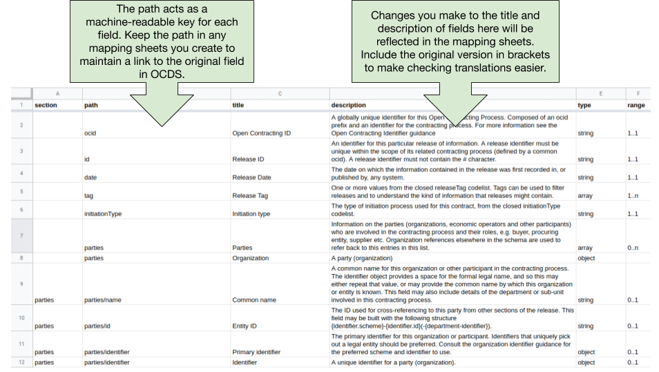
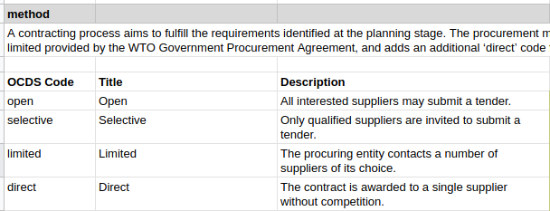

# Localizing OCDS

OCDS is a global standard for the publication of the key contracting data that users need. Publishing standardized data supports analysis across countries and the development of reusable tools. But, to get the most out of OCDS, it can be useful to localize the standard to your context. This guide explains how to:

* Document the local definition of OCDS terms
* Map between disclosures required by law and OCDS fields
* Extend the standard to publish more fields
* Translate the standard into your language
* Document and share your work

## Documenting the local definition of OCDS terms

OCDS uses terms that make sense across different jurisdictions so that data is interoperable. But, in some cases, it can be useful to maintain a mapping between OCDS terms and local terms. This can help local users understand exactly how to interpret a field in the standard.

For example, the current Spanish translation of OCDS uses the term 'Artículos que se adquirirán' for the 'Line Items'. Whereas in Mexico the equivalent term is ‘Items de la licitación’.

You can use the [field-level mapping template](https://www.open-contracting.org/resources/ocds-field-level-mapping-template/) to document localized titles and descriptions for OCDS fields. The **OCDS Schema** sheet contains the titles and descriptions used in the mapping sheets.



To localize a field title or description, edit the values columns C or D. We recommend that you keep the original title or description in brackets after your localized version. For example:

```{eval-rst}
.. csv-table::
   :file: ../../examples/localization.csv
   :widths: 30,70
   :header-rows: 1
```

This makes it easier for reviewers to check that localization has not changed the meaning of titles and descriptions. You can use the comments feature of Google Docs to discuss the proposed localization.

```{eval-rst}
.. admonition:: Warning
   :class: warning

   .. markdown::

      Do not edit the values in column B. These are the OCDS field paths which cannot be edited.
```

If you create your own mapping sheet, make sure to include the original OCDS field paths to link your mapping to the fields in OCDS.

Similarly, you can use the [codelist mapping template](https://www.open-contracting.org/resources/ocds-1-1-codelist-mapping-template/) to document localized titles and descriptions for codes in [OCDS codelists](../../schema/codelists/).



To localize a code title or description, edit the values in columns B and C. As with field titles and descriptions,  we recommend that you keep the original title or description in brackets after your localized version.

```{eval-rst}
.. admonition:: Warning
   :class: warning

   .. markdown::

      Do not edit the values in column A. These are the OCDS field paths which cannot be edited.
```

You can ask the [OCDS Helpdesk](../../support/index) to review your localized mapping template before you put it to use.

## Mapping between disclosures required by law and OCDS fields

When local legislation mandates specific contracting disclosures, it can be useful to:

* Identify the legal requirements related to OCDS fields
* Identify any extra fields or documents needed to meet legal requirements
* Identify any OCDS fields which cannot be published for legal reasons

You can use the [field-level mapping template](https://www.open-contracting.org/resources/ocds-field-level-mapping-template/) to document a mapping to local legislation. If you localized the mapping template, then start with the localized version.

You will need a clear list of the disclosure requirements set out in law. These should be divided up by which stage of the contracting process they apply to and under which circumstances.

Work through the OCDS tabs (1. - 6.) for each stage of the contracting process and for each field note any related legal requirements. Use column E to note the requirements or add a new column if you prefer.

OCDS often breaks down the concepts used in disclosure legislation to make sure the data is useful. For example, the concept of a supplier is broken down into fields for the supplier's name, organization identifier and address. So you may find that one legal requirement maps to many fields.

There may be some disclosure requirements that are not covered by OCDS fields. Use the space at the bottom of each mapping sheet to list any extra requirements.

Provide as much detail as you can about these extra requirements and then share your mapping with the OCDS Helpdesk. The helpdesk can work with you to identify whether to model the requirements using an existing field or whether to develop an extension.

## Extending the standard

OCDS is an extensible standard. Extensions are used to document the meaning, structure and format of additional fields so that users and tools can interpret them.

Refer to the [extensions documentation](extensions) for more information on using and developing extensions.

## Translating the standard

French and Spanish translations of the schema and documentation are maintained by OCP and a community translation to Italian is also available. Other community translations exist to various levels of completion.

If the standard is not yet available in your language, you can propose a new translation of the schema and documentation, or collaborate on an existing community translation.

Translations are managed using [Transifex](https://www.transifex.com/open-contracting-partnership-1/open-contracting-standard-1-1/) which can generate translated versions of the schema, documentation and other resources.

Contact the [OCDS Helpdesk](../../support/index) to get access to Transifex or to propose a new translation.

## Document and share your work

Whatever you do to localize the OCDS, it’s important to provide clear documentation. For example, you could set-up a page on your website with links to the main standard documentation, and details of your localization.

It’s also important to share updates with the OCDS community, through the [standard-discuss mailing list](https://groups.google.com/a/open-contracting.org/forum/#!forum/standard-discuss) and the [GitHub issue tracker](https://github.com/open-contracting/standard). Without doing this, there is a chance that you might be duplicating work that others have already undertaken, or missing out on insights from other projects working on similar issues.
