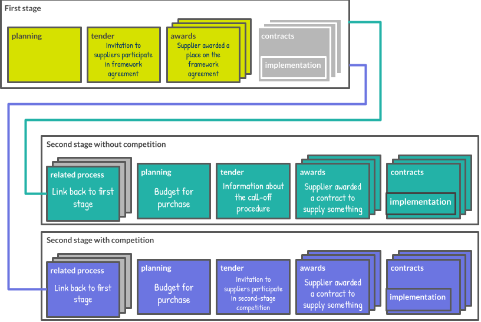

# Framework Agreements and Related Processes

```eval_rst
.. admonition:: Note
    :class: note

    .. markdown::

      The approach for modelling framework agreements in OCDS 1.2 is under discussion ([GitHub issue](https://github.com/open-contracting/standard/issues/440)).

```

```eval_rst
.. admonition:: Note
    :class: note

    .. markdown::

      In this guidance we defer to the definitions given in the [UNCITRAL Model Law on Public Procurement (2011)](https://uncitral.un.org/en/texts/procurement/modellaw/public_procurement). The model law was developed through extensive consultation and reflects the procurement practices and concepts used in many different jurisdictions.

```

The UNCITRAL model law defines a framework agreement procedure as:

> Procedure conducted in two stages: a first stage to select a supplier (or suppliers) or a contractor (or contractors) to be a party (or parties) to a framework agreement with a procuring entity, and a second stage to award a procurement contract under the framework agreement to a supplier or contractor party to the framework agreement.

In OCDS terms, a framework agreement procedure is a procedure involving at least one framework agreement. A framework agreement is defined in UNCITRAL as:

> Agreement between the procuring entity and the selected supplier (or suppliers) or contractor (or contractors) concluded upon completion of the first stage of the framework agreement procedure._

In OCDS we treat “contractors” and “suppliers” as synonyms. One or more buyers and one or more suppliers can participate in a framework agreement.

A procurement contract is defined as:

> Contract concluded between the procuring entity and a supplier  (or suppliers) or a contractor (or contractors) at the end of the procurement proceedings._

Framework agreements can be **open** or **closed**:

**Closed framework agreement**

> Framework agreement to which no supplier or contractor that is not initially a party to the framework agreement may subsequently become a party_

**Open framework agreement**

> Framework agreement to which a supplier (or suppliers) or a contractor (or contractors) in addition to the initial parties may subsequently become a party or parties._

Procurement systems which provide for closed framework agreements include the EU (Framework Agreements, per Directive 2014/24/EU, Article 33) and the US federal system (Indefinite-delivery contracts, per Federal Acquisition Regulation, Subpart 16.5). An example of a procurement system which provides for open framework agreements is the EU (Dynamic Purchasing Systems, per Directive 2014/24/EU, Article 33).

Framework agreement procedures can involve second-stage competition, or not:

**Framework agreement procedure with second-stage competition**

> Procedure under an open framework agreement or a closed framework agreement with more than one supplier or contractor in which certain terms and conditions of the procurement that cannot be established with sufficient precision when the framework agreement is concluded are to be established or refined through a second-stage competition.

**Framework agreement procedure without second-stage competition**

> Procedure under a closed framework agreement in which all terms and conditions of the procurement are established when the framework agreement is concluded.

Competition at the second stage is limited to suppliers that are party to the framework agreement. Framework agreement procedures can include a mix of competitive and non-competitive second stages.

The second stage of a framework agreement procedure is also known as a “call-off.” Non-competitive second stages are also known as “direct call-offs.” Competitive second stages are also known as “mini-competitions.”


## Modelling framework agreements in OCDS

OCDS defines a contracting process as:

> All the planning, tendering information, awards, contracts and contract implementation information related to a single initiation process.

A contracting process brings together, under a single identifier, the information that users need to answer questions such as:

* Was a contract signed as a result of this tender?
* What was the total value of spending that resulted from this award?
* Was a renewal of this contract signed?

In some cases, complex contracting processes cannot be represented under a single identifier under OCDS’ current model, because:

* There are multiple competitive stages: for example, when a framework agreement involves second-stage competitions;
* The procurement systems used at different stages of the process are managed by different bodies, and cannot be integrated;

OCDS models the first and second stages of framework agreement procedures as separate contracting processes, linked together using the `relatedProcesses` array. The techniques extension is used to identify contracting processes which represent the first stage of a framework agreement procedure. The presence of a related process with a `.relationship` set to ‘framework’ is used to identify contracting processes which represent the second stage of a framework agreement procedure.

The following diagram shows how OCDS models a framework agreement procedure with two second stages: one with competition and one without competition. Grey blocks represent unused sections of the OCDS schema.



The competitive extension is used to distinguish whether the second stage of a framework agreement procedure involves competition.

The following guidance describes how to model the different stages of a framework agreement procedure in OCDS.  

### Invitation to participate in the first stage of a framework agreement procedure

* Create a release and set `.tag` to 'tender'
* For each buyer that will participate in the framework agreement, add an `Organization` object to `parties`, set `.role` to 'buyer' and populate its other fields.
* If all public entities can participate, then omit them from the parties array and add a note in the publication policy to explain how users should interpret a contracting process with no buyers..
* If only one buyer will participate in the framework agreement, add an `OrganizationReference` object to `buyer` and set `.id` and `.name` to the values from the buyer's `Organization` object. Otherwise, don't populate `buyer`.
* In the `tender` section, set:
    *   `.techniques.hasFrameworkAgreement` to 'True'.
    *   `.contractPeriod` to the duration of the framework agreement.
    *   If the framework agreement is closed, set `.tenderPeriod.endDate` to the deadline for responses to the invitation.
    *   If the framework agreement is open, set `.tenderPeriod.endDate` to the last date that new suppliers can be added.

#### Setting procurement method

The `tender.procurementMethod` field uses the [method codelist](../../schema/codelists/#method) to describe the competitive conditions of the framework agreement procedure as a whole, not only the first stage.

Use the following criteria to determine the procurement method:

* If the contracting process will establish a framework agreement with a single supplier and if any supplier can submit a request to participate, i.e. there are no qualification criteria, then set `.procurementMethod` to 'open'.
* If the contracting process limits the suppliers that can submit a request to participate in the framework agreement, then set `.procurementMethod` to 'limited'.
* Otherwise, set `.procurementMethod` to ‘selective’.

### Addition of a supplier as a party to a framework agreement

* Create a release with the same `ocid` as the 'tender' release and set `.tag` to ‘award’
* Add an `Award` object to `awards`.
* For each supplier:
    *   Add an `Organization` object to `parties`, set `.role` to 'supplier' and populate its other fields.
    *   Add an `OrganizationReference` object to `awards.suppliers` and set `.id` and `.name` to the values from supplier's `Organization` object.
* If no further suppliers will be added to the framework agreement, set `tender.status` to 'complete'.

### Award of a procurement contract without second-stage competition

* Create a release with a new `ocid` and set `.tag` to 'award,contract’
* [Relate the second stage to the first stage](#relate-the-second-stage-to-the-first-stage)
* [Add a buyer](#add-a-buyer)
* [Add an award, contract and supplier](#add-an-award-contract-and-supplier)
* Include the `tender` section with the `tender.id` set to the `award.id`, include the `procuringEntity` if it exists, and set `tender.competitive` to ‘false’  

### Invitation to participate in a second-stage competition

* Create a release with a new `ocid` and set `.tag` to ‘tender’
* [Relate the second stage to the first stage](#relate-the-second-stage-to-the-first-stage)
* [Add a buyer](#add-a-buyer)
* Add a tender section and set `.procurementMethod` to the same value used in the first stage

### Award of a procurement contract resulting from a second-stage competition

* Create a release with the same ocid as the tender release for the second stage and set `.tag` to 'award, contract'
* [Add an award, contract and supplier](#add-an-award-contract-and-supplier)

### Updating the contract value, period or items

* If the initial contract value, period or items are subsequently updated, populate `contracts.value`, `contracts.period` and `contracts.items` with the updated values.

### Common operations

#### Relate the second stage to the first stage

* Add a `RelatedProcess` object to the `relatedProcesses` array, set its `.id` to '1', add 'framework' to its `.relationship` array, set its `.scheme` to 'ocid' and set `.identifier` to the `ocid` of the `ocid` of the invitation to participate in the framework agreement.

#### Add a buyer

* Add an `Organization` object to `parties`, set `.role` to 'buyer' and populate its other fields with the details of the buyer for this specific contract.
* Add an `OrganizationReference` object to `buyer` and set `.id` and `.name` to the values from the buyer's `Organization` object.

#### Add an award, contract and supplier

* Add an `Award` object to `awards` and a `Contract` object to `contracts`
* Set `awards.id` and `contracts.id` to the same value
* Add an `Organization` object to `parties`, set `.role` to 'supplier' and populate its other fields.
* Add an `OrganizationReference` object to `awards.suppliers` and set `.id` and `.name` to the values from the supplier's `Organization` object.
* Populate `awards.value`, `awards.contractPeriod` and `awards.items` with the initial contract value, period and items respectively

### Extensions

The `tender.techniques.hasFrameworkAgreement` field is used to identify contracting processes which represent the first stage of a framework agreement procedure. This field is added by the [Techniques Extension](https://github.com/open-contracting-extensions/ocds_techniques_extension). More information on the nature of the framework agreement can be provided in the ``FrameworkAgreement`` object.

The  `tender.competitive` field is used to identify if the second stage is competitive or not. This field is added by the [Competitive Extension](https://github.com/open-contracting-extensions/ocds_competitive_extension).

The techniques and competitive extensions should also be declared in the package metadata:

```eval_rst

.. literalinclude:: ../../examples/frameworks/extensions_block.json
    :language: json

```

## Worked examples

The following examples show how to model two types of framework agreement, covering a range characteristics::

1. A closed framework agreement established for a single buyer, with a single supplier and **without** second-stage competition
2. A open framework agreement established for multiple buyers, with multiple suppliers and **with** second-stage competition

### Closed framework agreement with single buyer, single supplier and without second-stage competition

NHS National Services Scotland (NSS) wants to establish a framework agreement for the receipt, storage and distribution of seasonal influenza vaccines to GP practices, social care premises, vaccine holding centres and community pharmacies across NHS Scotland.

#### Invitation to participate in the first stage

NSS issues a [contract (tender) notice](https://ted.europa.eu/udl?uri=TED:NOTICE:478648-2019:TEXT:EN:HTML) inviting suppliers to participate in the framework agreement. The tender notice specifies that the framework agreement is with a single operator. The framework agreement is not open, since the tender notice does not specify that the procurement involves the setting up of a dynamic purchasing system. The framework agreement is for a single buyer, since the tender notice specifies only one contracting authority.

The notice is modelled as an OCDS release with `tag` set to ‘tender’ and with the following properties:

* The techniques extension is declared in the package metadata.
* `tender.techniques.hasFrameworkAgreement` is set to “true” to indicate that this contracting process is for the set-up of a framework agreement.
* Since the framework agreement will be concluded with a single supplier and since any supplier is able to submit a response to the invitation to participate, we set the `procurementMethod` to ‘open’.
* Since the framework agreement is closed  `tenderPeriod` is set to the deadline for responses to the invitation to participate
* Since there is only one buyer, the `buyer` is set to reference the entry for NSS in the `parties` array.

```eval_rst

.. jsoninclude:: ../../examples/frameworks/closed_single_first_stage.json
   :jsonpointer:
   :title: First Stage

```

#### Adding a supplier as a party to the framework agreement

NSS issues a [contract award notice](https://ted.europa.eu/udl?uri=TED:NOTICE:268595-2020:TEXT:EN:HTML&src=0) to announce that the framework agreement has concluded with a single supplier: Movianto UK.

The notice is modelled as an OCDS release with the same `ocid` as the previous release and with `tag` set to ‘award’. The release has the following properties:

* `tender.status` is set to ‘complete’ as no further suppliers will be added to the agreement.
* An `Award` object is added to the `awards` array.
* An `Organization` object is added to the `parties` array with the supplier’s details.
* An `OrganizationReference` object is added to `award.suppliers` to reference the supplier’s details in the `parties` array.

```eval_rst

.. jsoninclude:: ../../examples/frameworks/closed_single_supplier.json
   :jsonpointer:
   :title: Adding a supplier

```

The first stage of the framework agreement procedure is complete and NSS can now purchase services from the supplier.

#### Award of a procurement contract without second-stage competition

NSS uses the framework agreement to place an order for the supplier to receive and store ten pallets of seasonal flu vaccine. Under the terms of the agreement the cost for this service is £10,000.

The order represents the award of a procurement contract at the second stage of the framework agreement procedure.

In OCDS the second stage of the framework agreement procedure is represented as a separate contracting process with a new OCID. The contracting process for the second stage is  linked to the contracting process for the first stage of the procedure using the `relatedProcess` section.

Because there was no competition at the second stage, the new contracting process has only one release, with `tag` set to ‘award,contract’.

The release has the following properties:

* A minimal  `tender` block is included, populating the `tender.id`, and with `tender/competitive` set to false.
* The `relatedProcess` block is populated with a reference to the contracting process for the first stage
* The `buyer`, `tender/procuringEntity`, `awards/suppliers` and `parties` sections are populated with the details of the buyer, procuring entity and supplier.
* The `awards` section is populated with the initial contract value, period and items
* The `contracts` section is populated and linked to the award.

```eval_rst

.. jsoninclude:: ../../examples/frameworks/closed_single_award.json
   :jsonpointer:
   :title: Award of a procurement contract

```

Each purchase made under the framework agreement is represented by a new contracting process with a new `ocid`.

### Open framework agreement with multiple buyers, with multiple suppliers and with second-stage competition

The National Procurement Agency in Chile (Chile Compra) wants to establish a framework agreement for the purchase of office supplies, including paper and stationery items for the different public entities across Chile.

#### Invitation to participate in the first stage

Chile Compra publishes a [tender notice](https://www.mercadopublico.cl/Procurement/Modules/RFB/DetailsAcquisition.aspx?qs=TLr0Si6+0YXBLbyobaRgPQ==) inviting suppliers to participate in the framework agreement. The tender notice specifies that multiple suppliers can join the framework agreement. The framework agreement is open, since all the framework agreements in Chile involve the setting up of a dynamic purchasing system. The framework agreement is for multiple buyers, since the tender notice specifies two contracting authorities.

The notice is modelled as an OCDS release with `tag` set to ‘tender’ and with the following properties:

* The techniques extension is declared in the package metadata.
* `tender.techniques.hasFrameworkAgreement` is set to “true” to indicate that this contracting process is for the set-up of a framework agreement.
* Since the framework agreement will be concluded with multiple suppliers and will involve second-stage competition, `tender.procurementMethod` is set to ‘selective’.
* Since the framework agreement is open  `tenderPeriod` is set to the end of the framework agreement.
* Since there are two buyers, the ‘buyer’ object is not set, and the buyers are declared in the `parties` array.
* Since Chile Compra is the entity who manages the procurement process, the `procuringEntity` is set to reference the entry for Chile Compra in the `parties` array.

```eval_rst

.. jsoninclude:: ../../examples/frameworks/open_multiple_first_stage.json
   :jsonpointer:
   :title: First Stage

```

#### Adding a supplier as a party to the framework agreement

Chile Compra issues an [award notice](https://www.mercadopublico.cl/Procurement/Modules/RFB/StepsProcessAward/PreviewAwardAct.aspx?qs=TLr0Si6+0YXBLbyobaRgPQ==) to announce that the framework agreement has been awarded to two suppliers: RODRIGO ALEJANDRO VIDAL CAMPOS and COMERCIALIZADORA E IMPORTADORA GRUPO RAVC SPA.

The notice is modelled as an OCDS release with the same `ocid` as the previous release and with `tag` set to ‘award’. The release has the following properties:

* No updates are made to `tender.status` since other suppliers are still able to submit a request to participate in the framework agreement
* An `Award` object is added to the `awards` array.
* An `Organization` object per supplier is added to the `parties` array with the supplier’s details.
* An `OrganizationReference` object per supplier is added to `award.suppliers` to reference the supplier’s details in the `parties` array.

```eval_rst

.. jsoninclude:: ../../examples/frameworks/open_multiple_supplier.json
   :jsonpointer:
   :title: Adding a supplier

```

The framework is now established, and both buyers can now purchase items from the suppliers.

#### Invitation to participate in a second-stage competition

Servicio Local de Educación Pública Puerto Cordillera invites suppliers on the framework to bid for a contract to buy 200 pencils with a [tender notice](https://www.mercadopublico.cl/CMII/Tienda/frm_GCV2_Ficha.aspx?IURL=uPteMZpbYBeM$07gdm9g$08EFecMSuZM0euS4Z$07cbeFMX_05ohEOMPbeteMZpbYBeM). This represents an invitation to participate in a second-stage competition.

In OCDS the second stage of the framework agreement procedure is represented as a separate contracting process with a new OCID. The contracting process for the second stage is linked to the contracting process for the first stage of the procedure using the `relatedProcess` section.

The release has the following properties:

* The `tag` is set to ‘tender
* Include the information about the competition as normal in the tender block, and set `competitive` to true.
* In this new process, we set the `buyer` to Servicio Local de Educación Pública Puerto Cordillera.
* Related this process with the framework agreement set up using the `relatedProcess` block with `relationship` field set to ‘framework’.

```eval_rst

.. jsoninclude:: ../../examples/frameworks/open_multiple_second_stage.json
   :jsonpointer:
   :title: Second Stage

```

#### Award of a procurement contract resulting from a second-stage competition

Following the invitation to participate in the second-stage competition, Servicio Local de Educación Pública Puerto Cordillera awards a contract to COMERCIALIZADORA E IMPORTADORA GRUPO RAVC SPA.

The release has the following properties:

* The same `ocid` as the invitation to participate in the second-stage competition is used.
* The `tender/status` is updated to ‘complete’
* The `tag` is set to ‘award,contract’.
* The `awards` section is populated with the initial contract value, period and items.
* The `contracts` section is populated and linked to the award.
* The `relatedProcess` block is populated with a reference to the contracting process for the first stage
* The `buyer`, `tender/procuringEntity`, `awards/suppliers` and `parties` sections are populated with the details of the buyer, procuring entity and supplier.

```eval_rst

.. jsoninclude:: ../../examples/frameworks/open_multiple_award.json
   :jsonpointer:
   :title: Award of a procurement contract

```
