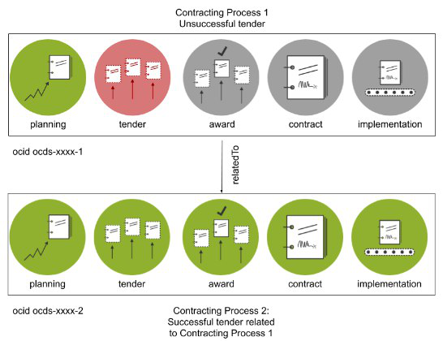

# Unsuccessful tenders

In the case of procurement, a contracting process can be defined as a procurement procedure. There is a one-to-one correspondence between the first stage of a procurement procedure (tender) and a contracting process.

In OCDS, at a conceptual level, a contracting process is intended to match each concrete attempt to start a procedure that leads to one or more contracts. Attempts can include: an invitation to tender (in open procedure); an invitation to request to participate; a competition for a concession; a direct award, etc.


In OCDS, the `ocid` is the unique identifier for a contracting process. As the initiation of the procurement process is the tender, normally the identifier for a tender can be used as the `ocid`.

In most jurisdictions, if a procedure is cancelled or unsuccessful, and a **new procedure** is started to procure the same items, the two procedures are considered two **different** contracting processes. This is in keeping with the OCDS definition of a contracting process.

But in other jurisdictions, such as Paraguay, the planning stage is considered as the initiation of the process. In these jurisdictions when a tender fails and a new tender is started, the two tenders are considered part of the same contracting process. This differs from the OCDS definition of a contracting process.

In OCDS, it is relevant and desirable to include the planning information that relates to the process, but the contracting process is not interpreted as ‘starting’ with the planning stage. In OCDS, the planning stage is something that comes **before** the initiation of a contracting process. The initiation of the procedure is not the planning stage, because at least one of the following is true of a planning stage: it is not a concrete attempt to award one or more contracts like a request for tender, etc.; it is not a concrete opportunity for potential suppliers to participate in; it does not describe the competitive conditions.

However a jurisdiction treats unsuccessful tenders and subsequent tenders, in OCDS they are considered separate but related contracting processes.

This relationship can be modelled using the `relatedProcess` array at the release level, with the ‘unsuccessfulProcess’ relationship type.  



## Example: Modelling unsuccessful tenders in Paraguay

The [Sistema de Información de las Contrataciones Públicas (SICP)](https://contrataciones.gov.py/) discloses information about contracting processes for all public entities in Paraguay. SICP is managed by the National Directorate of Public Procurement (DNCP in Spanish).

Paraguay discloses all stages of the contracting process, from planning to implementation. The first data disclosed is about the planning stage. Planning data includes an estimate of what an entity is going to buy, when and for how much. SICP assigns an `ocid` when the planning data is first disclosed, before the tender stage. In this example, the ocid is 'ocds-03ad3f-331547-1'.

```{eval-rst}
.. jsoninclude:: ../../examples/unsuccessful-tender-planning.json
   :jsonpointer:
   :expand: releases, planning
   :title: unsuccessful-tender-planning

```

Next, the tender data is disclosed, but the tender was unsuccessful, so the tender status is ‘unsuccessful’.

```{eval-rst}
.. jsoninclude:: ../../examples/unsuccessful-tender-tender.json
   :jsonpointer:
   :expand: releases, tender, status
   :title: unsuccessful-tender-tender

```

The buyer issues another tender to buy the same item, based on the same planning as the first tender.

Paraguay considers the two tenders part of the same contracting process. But, in OCDS the two tenders are separate contracting processes.

To construct an `ocid` for the second contracting process, Paraguay adds a consecutive number to the `ocid` of the first process. In this example the new `ocid` is 'ocds-03ad3f-331547-2'

Paraguay could also have used the identifier for the second tender as the `ocid` for the second contracting process.

The `relatedProcess` block links the two processes, with the relationship set to ‘unsuccessfulProcess’.

```{eval-rst}
.. jsoninclude:: ../../examples/unsuccessful-tender-related-process.json
   :jsonpointer:
   :expand: releases, relatedProcesses, relationship
   :title: unsuccessful-tender-related-process

```
