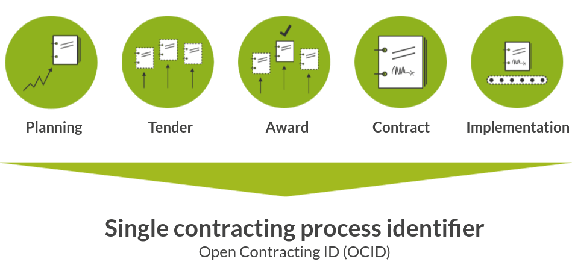

# How does the OCDS work?

```{admonition} Objectives
:class: note

The Open Contracting Data Standards (OCDS) is designed to support publishing data about contracting processes. This page will:

* Show how a contracting process is represented using the OCDS
* Introduce the OCDS schema
* Describe the formats for publishing OCDS data
```

<div class="video-wrapper">
<iframe width="560" height="315" src="https://www.youtube-nocookie.com/embed/Ibq0vEmDDzQ" title="Diving in to OCDS specifics" frameborder="0" allow="accelerometer; autoplay; clipboard-write; encrypted-media; gyroscope; picture-in-picture" allowfullscreen></iframe>
</div>

The OCDS defines a unique contracting process as all the actions aimed at concluding one or more contracts. An individual contracting process has several different stages: **tendering, awarding, contracting** and **implementation.** The OCDS describes a way to model and publish data in a standardized way along entire public contracting processes.

<div style="width:100%">

<div class="process-table">


**Tender**\
*Including:*\
Tender notices\
Specifications\
Line items\
Values\
Enquiries

</div>

<div class="process-table">


**Award**\
*Including:*\
Details of award\
Bidder information\
Bid evaluation\
Values

</div>

<div class="process-table">


**Contract**\
*Including:*\
Final details\
Signed contract\
Amendments\
Values

</div>

<div class="process-table">


**Implementation**\
*Including:*\
Payments\
Progress updates\
Location\
Extensions\
Amendments\
Completion or Termination info

</div>

</div>

<br clear="all"/>

The OCDS brings together the data published at each stage using a single open contracting process identifier: the **OCID.** An OCID is composed of a prefix [registered by the publisher with OCP](https://standard.open-contracting.org/latest/en/guidance/build/#register-an-ocid-prefix), and a unique process identifier chosen by the publisher.



The OCID helps users to join up data across the whole contracting process – a key feature and benefit of publishing and using OCDS data.

In designing the OCDS, we explored a range of different user needs and use cases for data about public contracting. Each use case has different data needs in terms of data fields, documents, publication frequency, and data quality. The OCDS provides a common framework to maximize the number of user needs that can be met through data and document disclosure.

The OCDS provides a common framework, in addition to the OCID, through the OCDS **schema.** The schema sets out the fields, structure, data types and validation rules for OCDS data. The schema is described using JSON Schema, and the default format of the data is JSON (JavaScript Object Notation). The schema is documented in the [Reference](https://standard.open-contracting.org/latest/en/schema/) section of the OCDS.

When mapping your data to the OCDS our sing OCDS data, you will encounter a number of common data fields and structures, which are described by the schema:

* **release metadata** - contextual information about each release of data;
* **parties** - information about the organizations and participants in the contracting process;
* **planning** - information about the goals, budgets and projects a contracting process relates to;
* **tender** - information about how a tender will take place, or has taken place;
* **awards** - information on awards made as part of a contracting process;
* **contract** - information on contracts signed as part of a contracting process;
* **implementation** - information on the progress of each contract towards completion.

Some schema fields refer to [codelists](https://standard.open-contracting.org/latest/en/schema/codelists/), to limit and standardize the possible values of the fields, in order to promote data interoperability.

When you publish OCDS data, the default format of the data is JSON. In addition to JSON format, OCDS can be published as Excel and CSV (comma-separated values) files.

```{admonition} Publication formats: JSON and Excel/CSV
:class: hint

While the OCDS schema is described using JSON Schema, OCDS data can be published in both JSON format and in tabular formats such as CSV files or spreadsheets. JSON is favored by developers because it uses human-readable text to exchange complex information, such as nested objects. It can contain large volumes of information and is particularly good at handling one-to-many relationships (such as multiple bids per tender notice).

Tabular formats, such as CSV (or comma separated values) are commonly used in spreadsheets applications and other analysis tools. Many people are comfortable working with spreadsheets using tools like Excel. While JSON is the default format, a good publication will publish tabular formats as well both so that more users’ needs can be satisfied.
```

No matter what type of contracting data you are working with or format you publish in, following OCDS rules and guidance will help you and your users to:

* Access clear definitions for the meaning, structure and format of your data
* Access a growing ecosystem of reusable tools and methodologies for working with OCDS data
* Compare your data with other publishers’ data to examine value for money and other types of analysis
* Check the structure, format and quality of your data against the OCDS schema

```{note}
**To learn more,** go to the next page in the primer: [How is OCDS data published?](releases_and_records) You can also review the further resources below to go deeper into the subjects introduced on this page.

* [Guidance to implementing OCDS](https://standard.open-contracting.org/latest/en/guidance/)
* [Video Learning Guide to the OCDS](https://www.youtube.com/playlist?list=PL7sSifLpWd8hLOVrNMiwNApXAsOr06E1Q)
* [OCP Learning: Publishing OCDS Data](https://www.open-contracting.org/learn/publish/)
* [Open Contracting Playbook: Component 2](https://docs.google.com/document/d/1Y_sYOqUfdRdnvU6P8-aJFqWw9LaTNbbIPS0oJtmskCQ/edit#heading=h.44c3tmyw3edx)
```
