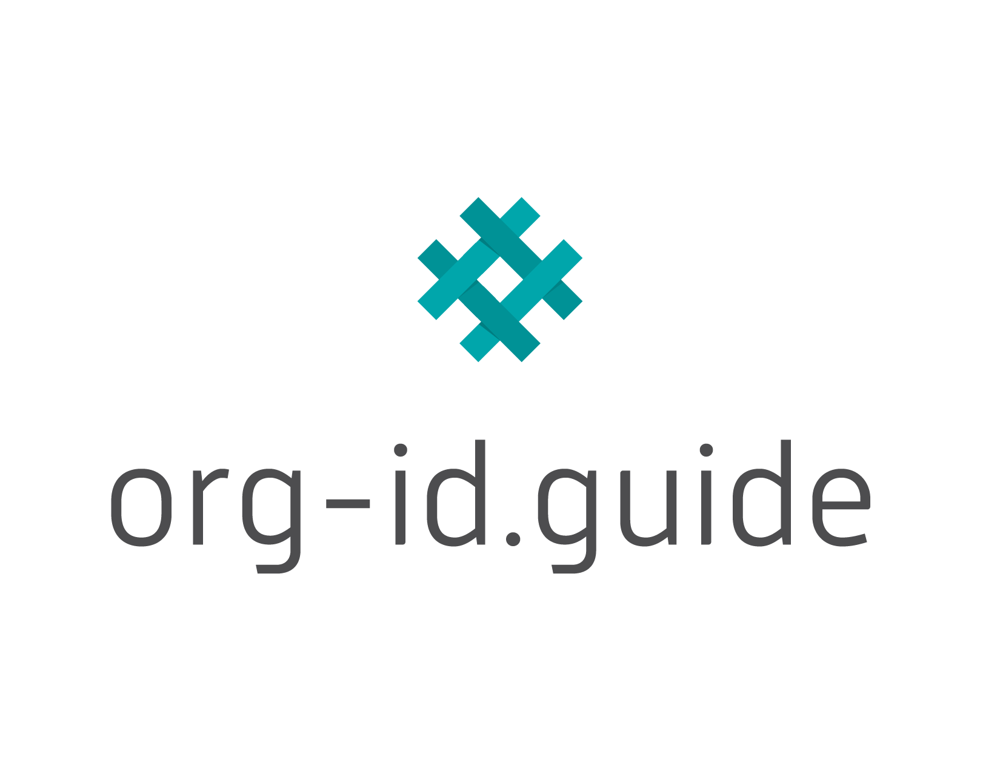

# Codelists

Some schema fields refer to codelists, to limit and standardize the possible values of the fields, in order to promote data interoperability.

Codelists can either be open or closed. **Closed codelists** are intended to be comprehensive; for example, the [currency](#currency) codelist covers all currencies in the world. **Open codelists** are intended to be representative, but not comprehensive.

Publishers must use the codes in the codelists, unless no code is appropriate. If no code is appropriate and the codelist is **open**, then a publisher may use a new code outside those in the codelist. If no code is appropriate and the codelist is **closed**, then a publisher is encouraged to create an issue in the [OCDS GitHub repository](https://github.com/open-contracting/standard/issues) about adding a new code.

```{admonition} Extending open codelists
:class: note

If you use new codes outside those in an open codelist, please document the codes in an [OCDS extension](../guidance/map/extensions) and in your [publication policy](../guidance/publish.md#finalize-your-publication-policy). Please also create an issue in the [OCDS GitHub repository](https://github.com/open-contracting/standard/issues), so that the codes can be considered for inclusion in the codelist.
```

The release schema, in [JSON Schema](../../build/current_lang/release-schema.json), has a `codelist` property to indicate the <a href="../../codelists/">CSV File</a> that defines the codes in the codelist (shown as tables below). It also has an `openCodelist` property, to indicate whether the codelist is open or closed.

Codes are case-sensitive, and are generally provided as English language camelCase. Codes must not be translated, though the OCDS team will work with publishers to translate code titles and definitions.

## Open Codelists

### Release Tag

A contracting (or planning) process can result in a number of releases of information over time. A release must be tagged to indicate whether it is about a planning process or a contracting process and, if it is about the latter, to indicate the stage of the contracting process to which it relates.

Additional codes may be used to label releases, based on user needs: for example, to indicate the notice or form to which a release corresponds.

```{versionchanged} 1.1
Added the 'planningUpdate' code.
```

```{csv-table-no-translate}
:header-rows: 1
:file: ../../build/current_lang/codelists/releaseTag.csv
```

### Organization Role

```{versionadded} 1.1
```

The organizations participating in a contracting (or planning) process are listed in the [parties section](reference.md#parties). In a given process, a single organization can have one or more roles.

```{csv-table-no-translate}
:header-rows: 1
:file: ../../build/current_lang/codelists/partyRole.csv
```

### Classification Scheme

The `classificationScheme` codelist is referenced by the `scheme` field of the `Classification` object, which can be used in multiple contexts. You can find the codes relevant to a given context by filtering the codelist by its `Category` column.

```{csv-table-no-translate}
:header-rows: 1
:file: ../../build/current_lang/codelists/classificationScheme.csv
```

### Unit Classification Scheme

```{versionadded} 1.1
```

Item quantities can be provided using an established codelist for units of measurement. Codelists might provide human-readable descriptions of units, or symbols for use in input and display interfaces.

```{csv-table-no-translate}
:header-rows: 1
:file: ../../build/current_lang/codelists/unitClassificationScheme.csv
```

### Organization Identifier Scheme



The Organization Identifier Scheme uses the codes from [org-id.guide](http://org-id.guide). The latest version of the codelist can be [downloaded](http://org-id.guide/download.csv) or [browsed](http://org-id.guide) from its website.

To add new codes to the codelist, contact the [Data Support Team](../../support/index).

```{versionchanged} 1.1
The `organizationIdentifierRegistrationAgency_iati.csv` file was removed. This list was formerly maintained by the International Aid Transparency Initiative.
```

### Document Type

The following list describes documents and documentation recommended for publication as part of an open contracting implementation. The codelist indicates the section of an OCDS release they are most likely to be applicable within. 

The code descriptions are necessarily broad, to cover their usage in a range of contracting (or planning) processes, including for goods, services and works, and in other contexts, such as public private partnerships, infrastructure or concession contracts. 

Publishers must map their existing document codes to this list, where possible. If using this list within a user interface, publishers can re-write the codelist titles and descriptions appropriately for the context they are being used in. 

```{csv-table-no-translate}
:header-rows: 1
:file: ../../build/current_lang/codelists/documentType.csv
```

### Award Criteria

The award criteria codelist describes the basis on which contract awards will be made. 

```{versionchanged} 1.1
Added all new codes. Deprecated all old codes, which were undefined.
```

```{csv-table-no-translate}
:header-rows: 1
:file: ../../build/current_lang/codelists/awardCriteria.csv
```

### Submission Method

```{deprecated} 1.2
```

The submission method codelist is used to identify the mechanism through which a submission can be made. 

```{csv-table-no-translate}
:header-rows: 1
:file: ../../build/current_lang/codelists/submissionMethod.csv
```

### Related Process

```{versionadded} 1.1
```

```{versionchanged} 1.2
Deprecated "parent-to-child" codes: 'subContract', 'replacementProcess' and 'renewalProcess'. Added sub-codes of prior: 'prior.replacement', 'prior.renewal', 'prior.additional' and 'prior.repetition'.
```

The related process block is used at the release level to point backwards to prior processes, such as a planning process or the first stage of a framework agreement procedure. The related process codelist determines the kind of relationship that is being described. For more information, see [contracting processes and planning processes](../guidance/map/contracting_planning_processes.md) and [framework agreements](../guidance/map/framework_agreements.md).

```{csv-table-no-translate}
:header-rows: 1
:file: ../../build/current_lang/codelists/relatedProcess.csv
```

### Related Process Scheme

```{versionadded} 1.1
```

The related process scheme describes the kind of identifier used to cross-reference another process. 

```{csv-table-no-translate}
:header-rows: 1
:file: ../../build/current_lang/codelists/relatedProcessScheme.csv
```

### Milestone Type

```{versionadded} 1.1
```

The milestone block can be used to represent a wide variety of events in the lifetime of a contracting (or planning) process. The milestone type codelist is used to indicate the nature of each milestone.

```{csv-table-no-translate}
:header-rows: 1
:file: ../../build/current_lang/codelists/milestoneType.csv
```

### Extended Procurement Category

```{versionadded} 1.1
```

The extended procurement category codelist is used to provide additional detail about the focus of a contracting (or planning) process. 

```{csv-table-no-translate}
:header-rows: 1
:file: ../../build/current_lang/codelists/extendedProcurementCategory.csv
```

### Language

```{versionadded} 1.2
```

The language codelist is used to provide the default language used in text fields and the language of linked documents, using two-letter codes from [ISO639-1](https://id.loc.gov/vocabulary/iso639-1.html).

```{csv-table-no-translate}
:header-rows: 1
:file: ../../build/current_lang/codelists/language.csv
```

### Media Type

```{versionadded} 1.2
```

The media type codelist is based on the [IANA Media Types](https://www.iana.org/assignments/media-types/media-types.xhtml) list. The media type codelist adds an exceptional code for printed documents ('offline/print'), and omits any media type that is marked as deprecated or obsolete by IANA.

```{csv-table-no-translate}
:header-rows: 1
:file: ../../build/current_lang/codelists/mediaType.csv
```

### Link Relation Type

```{versionadded} 1.2
```

The link relation type codelist is based on a subset of the [IANA Link Relation Types](https://www.iana.org/assignments/link-relations/link-relations.xhtml) list.

```{csv-table-no-translate}
:header-rows: 1
:file: ../../build/current_lang/codelists/linkRelationType.csv
```

## Closed Codelists 

### Country

```{versionadded} 1.2
```

The country codelist is used to provide the country component of an address, using uppercase two-letter codes from [ISO3166-1](https://www.iso.org/iso-3166-country-codes.html). The country codelist adds a user-assigned code for Kosovo ('XK').

```{csv-table-no-translate}
:header-rows: 1
:file: ../../build/current_lang/codelists/country.csv
```

### Initiation Type

```{deprecated} 1.2
```

```{csv-table-no-translate}
:header-rows: 1
:file: ../../build/current_lang/codelists/initiationType.csv
```

### Tender Status

The `tender.status` field is used to indicate the current status of a tender process. The following options are available:

```{versionchanged} 1.1
Added the 'planning' and 'withdrawn' codes.
```

```{csv-table-no-translate}
:header-rows: 1
:file: ../../build/current_lang/codelists/tenderStatus.csv
```

### Method

The procurement method describes which organizations can submit a bid. The method codelist draws upon [the definitions of open, selective and limited provided by the WTO Government Procurement Agreement](https://www.wto.org/english/docs_e/legal_e/rev-gpr-94_01_e.htm), and adds an additional 'direct' code for awards without competition.

```{versionchanged} 1.1
Added the 'direct' code.
```

```{csv-table-no-translate}
:header-rows: 1
:file: ../../build/current_lang/codelists/method.csv
```

### Procurement Category

```{versionadded} 1.1
```

The procurement category codelist is used to indicate the **primary** focus of a contracting (or planning) process. Where a contracting (or planning) process covers more than one of the options below, publishers should use the `additionalProcurementCategories` field with an array of entries from the open [extendedProcurementCategory](#extended-procurement-category) codelist.

```{csv-table-no-translate}
:header-rows: 1
:file: ../../build/current_lang/codelists/procurementCategory.csv
```

### Award Status

An award moves through multiple states. Releases over time can update the status of an award. 

The `awardStatus` field and codelist is used to indicate when a tender did not result in an award (through the `"awardStatus":"unsuccessful"` value).

```{csv-table-no-translate}
:header-rows: 1
:file: ../../build/current_lang/codelists/awardStatus.csv
```

### Contract Status

Contracts can move through multiple states. Releases over time can update the status of a contract.

To disclose that a contract is suspended, set the contract's `status` field to 'active' and use its `statusDetails` field to record that the contract is suspended. For more information, see the [contract suspension](../../guidance/map/contract_suspension) worked example.

```{versionchanged} 1.2
Added the 'terminatedEarly' and 'terminatedSuccessfully' codes.
```

```{csv-table-no-translate}
:header-rows: 1
:file: ../../build/current_lang/codelists/contractStatus.csv
```

### Milestone Status

```{versionchanged} 1.1
Added the 'scheduled' code.
```

```{csv-table-no-translate}
:header-rows: 1
:file: ../../build/current_lang/codelists/milestoneStatus.csv
```

### Currency

```{versionadded} 1.1
```

The currency for each amount must be specified using the uppercase 3-letter currency code from [ISO4217](https://www.iso.org/iso-4217-currency-codes.html).

```{csv-table-no-translate}
:header-rows: 1
:file: ../../build/current_lang/codelists/currency.csv
```

### Party Scale

```{versionadded} 1.2
```

The party scale codelist is used to indicate the size or scale of an organization, in particular commercial enterprises or economic operators.

The codes in the codelist do not have precise definitions. Instead, they defer to local laws and regulations, for example:

* [OECD: Small and Medium-Sized Enterprises (SMEs) definition](https://stats.oecd.org/glossary/detail.asp?ID=3123)
* [European Commission: What is an SME?](https://ec.europa.eu/growth/smes/sme-definition_en)

For small and medium-sized enterprises, if you can distinguish between the two sizes, use the 'small' and 'medium' codes. Otherwise, use the 'sme' code.

For self-employed individuals and sole traders, if you can distinguish them from micro enterprises, use the 'selfEmployed' code. Otherwise, use the 'micro' code.

For enterprises without employees, use the 'micro' code.

```{csv-table-no-translate}
:header-rows: 1
:file: ../../build/current_lang/codelists/partyScale.csv
```
