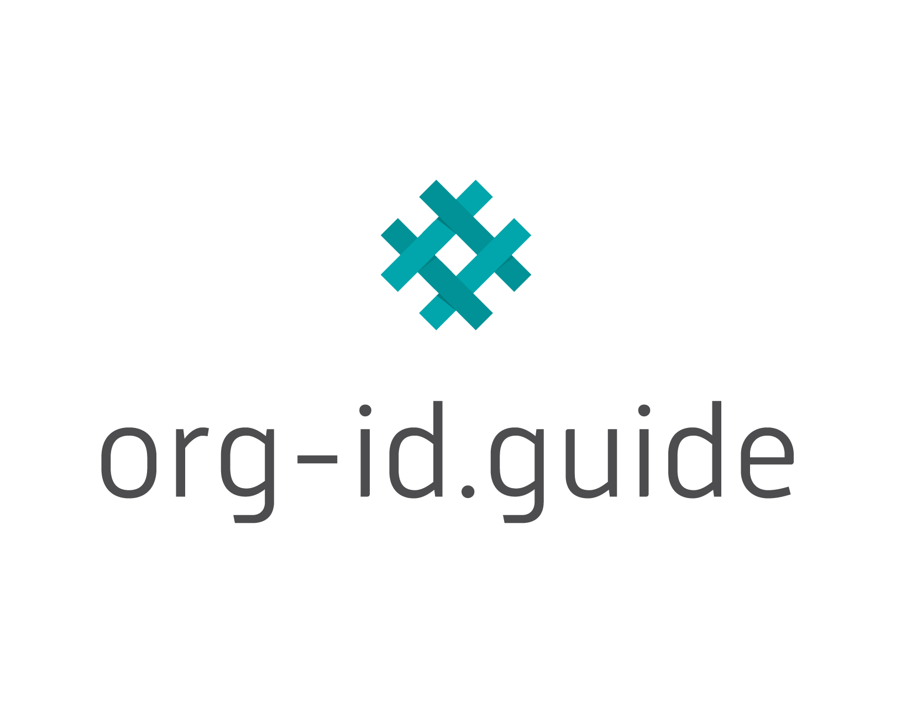

# Organization Identifier Scheme

{bdg-link-secondary}`Open<../../codelists/#codelists>`



The Organization Identifier Scheme uses the codes from [org-id.guide](http://org-id.guide). The latest version of the codelist can be [downloaded](http://org-id.guide/download.csv) or [browsed](http://org-id.guide) from its website.

To add new codes to the codelist, contact the [Data Support Team](../../support/index).

```{versionchanged} 1.1
The `organizationIdentifierRegistrationAgency_iati.csv` file was removed. This list was formerly maintained by the International Aid Transparency Initiative.
```
