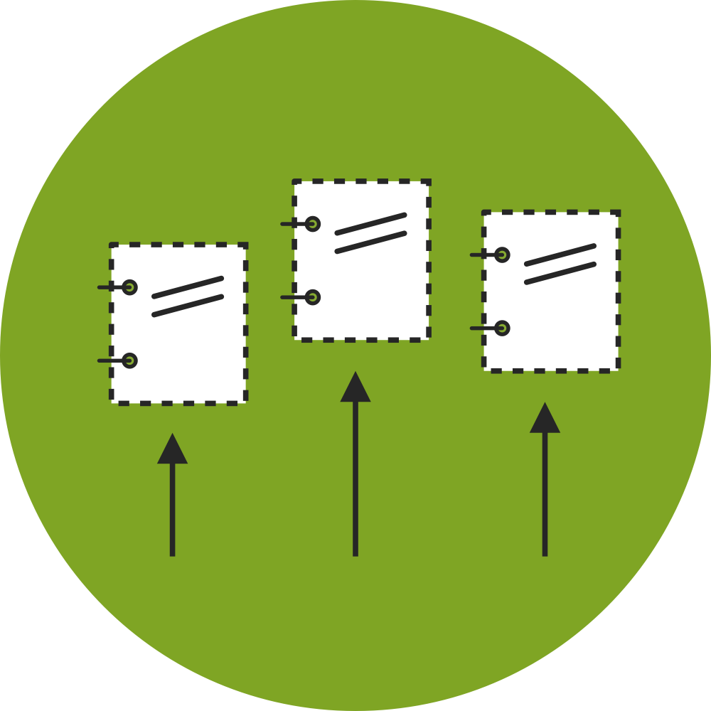
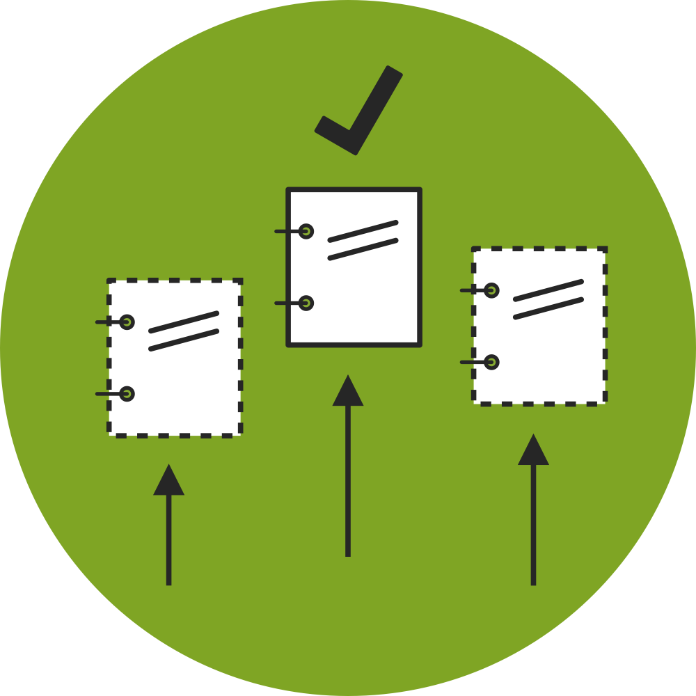

## The Contracting Process

There are several stages to a contracting process. 

OCDS covers:

<table style="margin-bottom:2em;">
    <tr>
        <td width="20%" align="center"></td>
        <td width="20%" align="center"></td>
        <td width="20%" align="center"></td>
        <td width="20%" align="center"></td>
        <td width="20%" align="center"></td>
    </tr>
    <tr>
        <td align="center"><span style="font-size:10pt;"><p><strong>Planning</strong></p><em>Including:</em><br/>Budgets<br/>Project plans<br/>Procurement plans<br/>Market studies<br/>Public hearing info</span></td>
        <td align="center"><span style="font-size:10pt;"><p><strong>Initiation (Tender)</strong></p><em>Including:</em><br/>Tender notices<br/>Specifications<br/>Line items<br/>Values<br/>Enquiries</span></td>
        <td align="center"><span style="font-size:10pt;"><p><strong>Award</strong></p><em>Including:</em><br/>Details of award<br/>Bidder information<br/>Bid evaluation<br/>Values</span></td>
        <td align="center"><span style="font-size:10pt;"><p><strong>Contract</strong></p><em>Including:</em><br/>Final details<br/>Signed contract<br/>Amendments<br/>Values</span></td>
        <td align="center"><span style="font-size:10pt;"><p><strong>Implementation</strong></p><em>Including:</em><br/>Payments<br/>Progress updates<br/>Location<br/>Extensions<br/>Amendments<br/>Completion or Termination info</span></td>
    </tr>
</table><div style="display:none;">
* 
* 
* 
* 
</div>  


Not all contracting processes have all stages. For example, direct contracting may start with the award of a contract. However, there will still be information that can be disclosed about the budgets, specifications and selection process even in this case. 

You should aim to publish OCDS data close to real-time: releasing data as each stage of a contracting process takes place.

This may involve generating output from a range of different systems. Data published from different systems can be tied together by use of a common Open Contracting ID (```ocid```).

### Defining a contracting process

For public procurement OCDS defines a unique contracting process as:

> All the planning, tendering information, awards, contracts and contract implementation information related to a single initiation process.

An initiation process may be a tender, a direct contract award, or a call to award a concession. 

<!-- TODO: Worked example/Diagram -->

### The Open Contracting ID (ocid)

Each unique contracting process should be assigned an ```ocid```. This is an identifier which can be used to join up data between different stages (as often the data may be stored in different systems). 

To make sure the ```ocid```s assigned by two different publishers do not clash, publishers are encouraged to register a publisher prefix. This can be prepended onto locally generated identifiers, giving a globally unique identifier, and allowing disparate data sources to confidently refer to a unique contracting process. 

You can [register your ocid prefix here](implementation/registration.md).

<div class="example hint" markdown=1>

<p class="first admonition-title">Worked Example</p>

In [Mexico City](http://www.contratosabiertos.cdmx.gob.mx/), an initial mapping identified that identifiers were assigned to each tender process or direct award, using a pattern based on the initials or name of the department involved, a tender or contract number, and the year. 

For example:

> OM-DGRMSG-004-13

These identifiers uniquely identify each contracting process. Fields and business processes to capture these identifiers at each contracting process stage were added to the relevant systems.

Mexico City then registered a prefix with the OCDS helpdesk. They have been given the prefix 'ocds-87sd3t' which can be added to their unique process identifiers to give a globally unique ocid. 

For example:

> ocds-87sd3t-OM-DGRMSG-004-13

All the award notices, contracts and transactions resulting from the tender with this identifier should also share this ocid - allowing Mexico City to bring together a complete picture of each contracting process.

</div>

<div class="warning" markdown=1>
    
<p class="first admonition-title">Note</p>
    
The ```ocid``` is case sensitive. Case should be used consistently whenever an ```ocid``` is presented.

</div>

### Extending OCDS

Version 1.0 of the OCDS schema is optimised for procurement-type contracts. 

However, using extensions OCDS can also be used to model other kinds contracting process. 

[Contact the helpdesk](support/index.md) for support to model your contracting processes using OCDS.