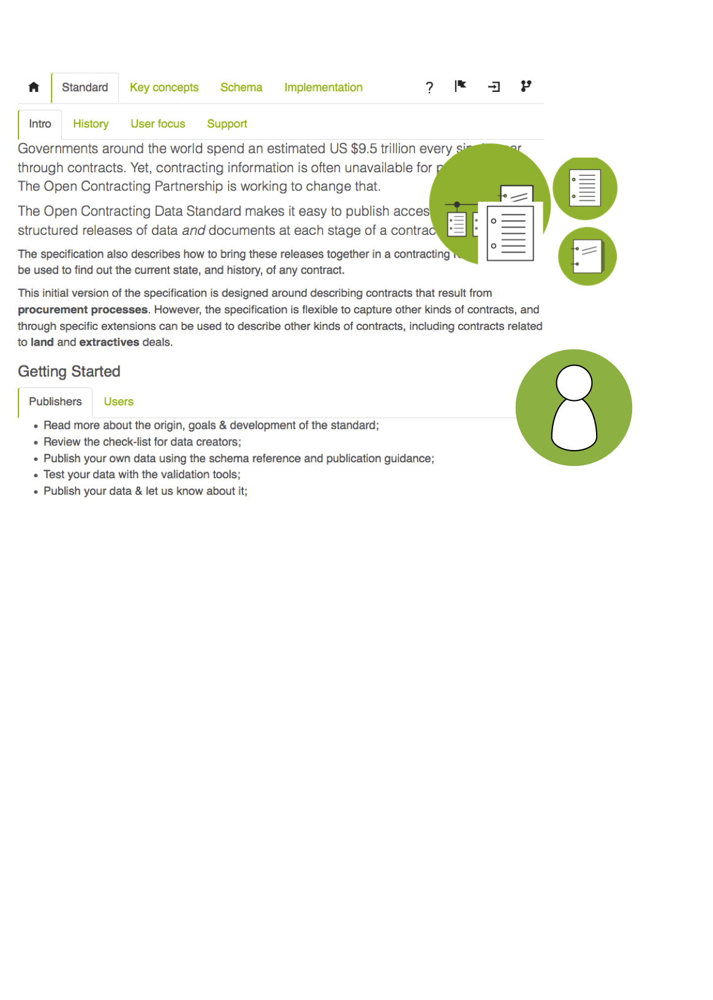

## Users and use cases

Open data is a means, not an end in itself. The first stage of any work with OCDS is to consider who will use the data that is produced, and which fields and features of the data are important to them.

In designing OCDS, we explored a range of different user needs and use cases for data on contracting. 

We focussed on four main groups of user need:

* Achieving value for money for government
* Strengthening the transparency, accountability and integrity of public contracting
* Enabling the private sector to fairly compete for public contracts
* Monitoring the effectiveness of service delivery

Some user needs are served by direct access to bulk data. To meet other user needs will require tools built on top of OCDS data, providing interfaces, visualisation, and links to spaces where users can engage with contracting bodies and data publishers. 

You can read more about how people around the world are using OCDS, and other contracting data, on the Open Contracting Partnership website. <!-- TODO: Add links -->

As you start implementing OCDS, consider how you will engage with data users, and how you will ensure the data and documents you make available will meet their needs. 

### Four example use cases

#### Value for money in procurement

Open contracting data can help officials to get good value for money on the goods and services in the procurement process, and can also help in identifying whether value for money has been achieved in concluded contracts. 

These users are want to analyze trends in prices and supplier performance, including in terms of quality and duration.

Comparable data using common codelists and the availability of unit prices are particularly important for value for money use cases.

#### Detecting fraud and corruption

All stakeholders (civil society, the private sector, government and donors) have an interest in identifying and combating corruption in public contracting. Open contracting data can be used to scrutinize procurement documents and data for ‘red flags’ that might indicate public monies are being mis-used. 

There are two main approaches to fraud and corruption monitoring. A ‘micro’ approach closely scrutinizes individual procurements.

A ‘systemic’ approach looks for suspicious patterns, and makes links between datasets to map out networks of funding, ownership and interests. 

Data that can be linked up using globally unique identifiers for companies is particularly important for fraud and corruption detection use cases.

#### Competing for public contracts

Open contracting data can be used by private firms to understand the potential pipeline of procurement opportunities. It is a core principle of open contracting that information should be made available at the early stages of a contracting process, including information on planned procurement, and invitations for tenders.

Information on past contracts can allow firms to identify upcoming opportunities for re-contracting, and can support a more competitive marketplace, as transparency creates a level playing field with information on pricing, contract dates and key deliverables. 

Forward looking and timely information is particularly important for private sector users, as well as being able to uniquely identify procuring entities, geographic locations, sectors, and the kinds of items which are being procured. 

#### Monitoring Service Delivery 
 
Monitoring groups want to ensure that public contracting delivers value to citizens in terms of quality of goods, works, and services provided. The monitor contracting effectively involves being able to link budgets and donor data to the contracts and results. It also involves being able to verify whether results are being delivered on the ground. 

Data concerning budgets, delivery location and subcontracting arrangements are particularly useful for those involved in contract monitoring. 
 

