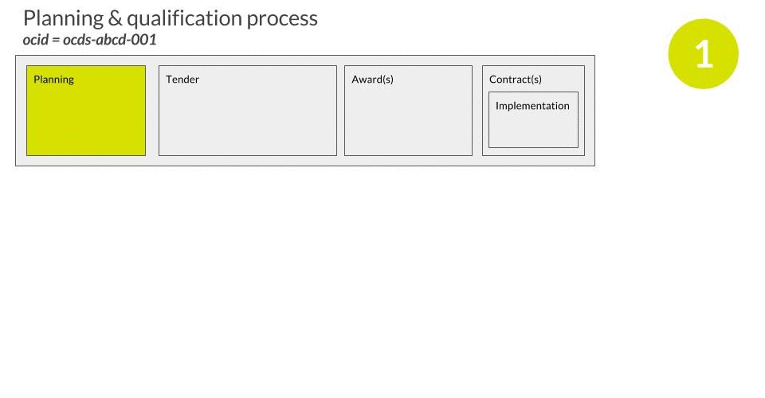

<style><!--
h3 ~ div {
margin-left:30px;
}
h3 ~ div > h4 {
border:1px solid black;
}
.example-background {
    background:lightGrey;
    padding:5px;
    margin:5px
}
.example-background h5 {
   background:grey;
   margin-bottom:5px  
}
--></style>
<script><!--
function defer(method) {
if (window.jQuery)
method();
else
setTimeout(function() { defer(method) }, 50);
}
defer(function() {
$("h5").each(function() { $(this).html(">>" + $(this).html());});
$("h5").click(function() { 
$(this).siblings().toggle('slow');   
});
$("h5").siblings().toggle();   
$("h5").parent().addClass("example-background");
});
--></script>

# PPP Disclosure Framework

<a href="#" onClick='$("h5").siblings().show()'>Show</a> / <a href="#" onClick='$("h5").siblings().hide()'>hide</a> implementation details and examples</a>

## Basic Project Information

**Disclosure timing:** Pre-procurement (as available)

*Note: This can be disclosed at the pre-procurement stage with the exception of information on the parties to the contract, which will be disclosed once it becomes available, that is, at the end of the procurement process.*

### I.1: Project name, location, sector

#### Project name and description

OCDS 1.1 includes a ```title``` and ```description``` field at the top level of each contracting process release. These titles and descriptions can be used by applications in summary lists, so should be kept concise and jargon free. 

We recommend keeping descriptions to one paragraph or less.

#### Sector classification

Projects should be classified using the UN Classification of the Functions of Government Scheme (COFOG). 

This can be cross-walked to most other PPP clasification schemes in use, and so provides a common framework for understanding the sectoral focus of investments. 

Additional classificaiton schemes can also be provided, such as project classification against the Sustainable Development Goals (SDGs), or against national frameworks. 

**Discussion:** See [#22](https://github.com/open-contracting/public-private-partnerships/issues/22) for further sector classification discussions.

##### Representation

The primary sector classification is provided using a [classification block](../../../schema/reference/#classification) at ```planning/project/sector```. 

Any additional classifications can be provided in an array of [classification blocks](../../../schema/reference/#classification) at ```planning/project/additionalClassifications```. 

The following scheme codes are recognised for ```sector```:

* COFOG - [UN Classification of the Functions of Government](http://unstats.un.org/unsd/cr/registry/regcst.asp?Cl=4) using the dotted numerical notation. (Note: set spreadsheet columns to 'text' to avoid the leading 0 being removed).

##### Example
```eval_rst

.. jsoninclude:: docs/en/examples/ppp/full.json
   :jsonpointer: /releases/0/planning/project
   :expand: sector
```

#### Location

The locations where a project is taking place can be specified using:

* **A gazeteer entry**. For example, the GeoNames code of the administrative division where activity is taking place.
* **A GeoJSON object**. Describing the boundary, or extent, of where activity will take place.

There are a range of tools available to generate GeoJSON data, such as http://geojson.io/

###### Representation

Locations are represented using an array of ```location``` objects at ```planning/project/locations```. Each location can have a description, a gazeteer entry, and/or a GeoJSON object representing a location point or geometery. 

See the location extension (ToDo: Add link) for further modelling details. 

##### Example

The example below uses a gazeteer and GeoJSON LineString to describe the location of a road project. 

```json
{ "releases": [{
        "planning": {
                "project": {
                    "sector": "transport",
                    "subSector": "roads",
                    "locations": [
                        {
                            "description": "Local area and route of the Mersey Gateway Bridge",
                            "gazetteer": {
                                "scheme": "GEONAMES",
                                "identifiers": "2647601.0"
                            },
                            "geometry": {
                                "type": "LineString",
                                "coordinates": [
                                  [
                                    -2.7485561370849605,
                                    53.36141150911515
                                  ],
                                  [
                                    -2.74383544921875,
                                    53.36018219246915
                                  ],
                                  [
                                    -2.741689682006836,
                                    53.35900406407135
                                  ],
                                  [
                                    -2.7359390258789062,
                                    53.357774677973616
                                  ],
                                  [
                                    -2.7240943908691406,
                                    53.35782590310244
                                  ],
                                  [
                                    -2.7213478088378906,
                                    53.35710874569601
                                  ],
                                  [
                                    -2.703065872192383,
                                    53.348348206285024
                                  ],
                                  [
                                    -2.7020359039306636,
                                    53.34517142558946
                                  ],
                                  [
                                    -2.702207565307617,
                                    53.34158445320748
                                  ],
                                  [
                                    -2.7028942108154297,
                                    53.33943212493747
                                  ]
                                ]
                              }
                        }
                    ]
                }
    }
}]
}

```

### I.2: Sponsoring agency/department

The sponsoring agency or department's details should be included in the ```parties``` section, with a role tag of 'sponsor'. 

#### Examples

###### JSON Example

```eval_rst

.. jsoninclude:: docs/en/examples/ppp/ocds-eg0001-pf-hmt-835-pqq-planning-01.json
   :jsonpointer: /releases/0/entities
   :expand: entities,identifier,address,contactPoint
```

###### Spreadsheet Example

```eval_rst
.. jsoninclude-flat:: docs/en/examples/ppp/ocds-eg0001-pf-hmt-835-pqq-planning-01.json
   :recursive:
   :jsonpointer: /releases/0/entities
   :ignore_path: /releases/0/
```


### I.3: Project value

The project value should be understood as the total amount project to be invested into the project by both public and private parties over the project lifetime.

This can be entered into ```planning/project/totalValue``` object, and should consist of a single value and currency.

Total budget allocations and a detailed breakdown by period, and contributing party, can be included in the ```planning/budget``` block using the budgetBreakdown extension.

**Discussion** See [#23](https://github.com/open-contracting/public-private-partnerships/issues/23) for a discussion of the exact definition of project value. 

### I.4: Project need: benefits provided, economic and social (including specific information on the public interest aspect)

Information on the project need, benefits provided, and economic and social impact should be provided through:

* A short summary text
* A link to one or more documents that provide additional information

These documents should be tagged with a ```documentType``` value of 'needsAssessment' in the ```planning/documents``` array. 

##### Example

```eval_rst

.. jsoninclude:: docs/en/examples/ppp/full.json
   :jsonpointer: /releases/0/planning/documents/0
   :expand: 
```

```eval_rst
.. jsoninclude-flat:: docs/en/examples/ppp/full.json
   :recursive:
   :jsonpointer: /releases/0/planning/documents/0
   :ignore_path: /releases/0/
```

### I.5: Technical description of the physical infrastructure

A technical description of the physical infrastructure should be provided through:

* A short summary text
* A link to one or more documents that provide additional information

These documents should be tagged with a ```documentType``` value of 'technicalSpecifications' in the ```tender/documents``` array. 

### I.6: High-level description of the services

A high-level description of the services should be provided through:

* A short summary text
* A link to one or more documents that provide additional information

These documents should be tagged with a ```documentType``` value of 'serviceDescription' in the ```tender/documents``` array. 

### I.7: Estimated demand to be served annually

Estimated demand can be provided using both structured data, and a document with the ```documentType``` of 'estimatedDemand'. 

Structured demand forecasts are provided through the ```planning/forecast``` building block.

This consists of an array of forecast metrics. A metric with the ```id``` 'demand' should be given, with a series of forecast ```observations``` that capture the estimated demand for a given period.

These estimates can be disaggregated by any number of dimensions contained as simple fields within the ```observation/dimensions``` object. 

#### Example 

```eval_rst

.. jsoninclude:: docs/en/examples/ppp/ocds-eg0001-pf-hmt-835-planning-01.json
   :jsonpointer: /releases/0/planning
   :expand: forecasts, observations, period, dimensions, unit
```

### I.8: Project additionality

Information on the project additionality should be provided through planning documents containing:

* A short summary text
* A link to one or more documents that provide additional information

These documents should be tagged with a ```documentType``` value of 'additionality' in the ```planning/documents``` array. 

(TODO: Clarify this section of the framework. See https://github.com/open-contracting/public-private-partnerships/issues/32)

### I.9: Reason for selection of PPP mode and type

A short summary of the reason for the PPP selection mode can be provided in ```tender/procurementMethodRationale``` field. 

If further information is available, this can be provided through using the documents block:

* A short summary text
* A link to one or more documents that provide additional information

These documents should be tagged with a ```documentType``` value of 'pppModeRationale' in the ```planning/documents``` array. 

### I.10: Dates of various approvals

This information can be provided using the ```milestones``` field in the relevant section of an OCDS release, for example information on approvals relating to the planning phase of a PPP should be provided in the ```planning/milestones``` field whilst information on approvals relating to the procurement phase should be provided in the ```tender/milestones``` field. OCDS provides a [milestones building block](../schema/reference/#milestone) for disclosure of information on milestones.

A value from the [milestone type codelist](../schema/codelists/#milestone-type) should be entered into the ```milestone/milestoneType``` field to identify the type of milestone being disclosed, for example a milestone relating to the planning phase of a PPP should be of type ```planning```. This enables applications consuming OCDS data to distinguish between the different types of milestone, whichever section of OCDS the milestone appears in, and allows publishers to be clear about the type of milestone they are publishing.

A value from the [milestone status codelist](../schema/codelists/#milestone-status) should be entered into the ```milestone/status``` field to identify the status of the milestone, for example an approval which has not yet taken place should have ```scheduled``` status whilst an approval which has been completed should have ```met``` status.

(TODO: build ppp-schema with [milestones update](https://github.com/duncandewhurst/ocds-milestones-update) + update codelists documentation)

TODO: Investigate proposal for Approvals building block https://github.com/open-contracting/standard/issues/403

### Contract Milestones (Estimated and Actual)

#### I.11: Date of commercial close

This information can be provided using the ```milestones``` field in the ```tender``` section of an OCDS release. OCDS provides a [milestones building block](../schema/reference/#milestone) for disclosure of information on milestones.

The ```milestone/milestoneType``` field should be set to ```???```. This enables applications consuming OCDS data to distinguish between the different types of milestone, whichever section of OCDS the milestone appears in, and allows publishers to be clear about the type of milestone they are publishing.

A value from the [milestone status codelist](../schema/codelists/#milestone-status) should be entered into the ```milestone/status``` field to identify the status of the milestone, for example the expected date for the milestone should have ```scheduled``` status and once the milestone has been completed the status should be set to ```met```.

(TODO: see [github issue](https://github.com/open-contracting/public-private-partnerships/issues/25))

#### I.12: Date of financial close

This information can be provided using the ```milestones``` field in the ```tender``` section of an OCDS release. OCDS provides a [milestones building block](../schema/reference/#milestone) for disclosure of information on milestones.

The ```milestone/milestoneType``` field should be set to ```???```. This enables applications consuming OCDS data to distinguish between the different types of milestone, whichever section of OCDS the milestone appears in, and allows publishers to be clear about the type of milestone they are publishing.

A value from the [milestone status codelist](../schema/codelists/#milestone-status) should be entered into the ```milestone/status``` field to identify the status of the milestone, for example the expected date for the milestone should have ```scheduled``` status and once the milestone has been completed the status should be set to ```met```.

(TODO: see [github issue](https://github.com/open-contracting/public-private-partnerships/issues/25))

#### I.13: Date of commencement of construction or development

This information can be provided using the ```milestones``` field in the ```tender``` section of an OCDS release. OCDS provides a [milestones building block](../schema/reference/#milestone) for disclosure of information on milestones.

The ```milestone/milestoneType``` field should be set to ```delivery```. This enables applications consuming OCDS data to distinguish between the different types of milestone, whichever section of OCDS the milestone appears in, and allows publishers to be clear about the type of milestone they are publishing.

A value from the [milestone status codelist](../schema/codelists/#milestone-status) should be entered into the ```milestone/status``` field to identify the status of the milestone, for example the expected date for the milestone should have ```scheduled``` status and once the milestone has been completed the status should be set to ```met```.


#### I. 14: Date of completion of construction or development

This information can be provided using the ```milestones``` field in the ```tender``` section of an OCDS release. OCDS provides a [milestones building block](../schema/reference/#milestone) for disclosure of information on milestones.

The ```milestone/milestoneType``` field should be set to ```delivery```. This enables applications consuming OCDS data to distinguish between the different types of milestone, whichever section of OCDS the milestone appears in, and allows publishers to be clear about the type of milestone they are publishing.

A value from the [milestone status codelist](../schema/codelists/#milestone-status) should be entered into the ```milestone/status``` field to identify the status of the milestone, for example the expected date for the milestone should have ```scheduled``` status and once the milestone has been completed the status should be set to ```met```.


#### I.15: Date of commissioning

This information can be provided using the ```milestones``` field in the ```tender``` section of an OCDS release. OCDS provides a [milestones building block](../schema/reference/#milestone) for disclosure of information on milestones.

The ```milestone/milestoneType``` field should be set to ```delivery```. This enables applications consuming OCDS data to distinguish between the different types of milestone, whichever section of OCDS the milestone appears in, and allows publishers to be clear about the type of milestone they are publishing.

A value from the [milestone status codelist](../schema/codelists/#milestone-status) should be entered into the ```milestone/status``` field to identify the status of the milestone, for example the expected date for the milestone should have ```scheduled``` status and once the milestone has been completed the status should be set to ```met```.

#### I.16: Date of contract expiry

This information can be provided using ```contractPeriod``` field in the ```tender``` section of an OCDS release. OCDS provides a [period building block](../schema/reference/#period) for disclosure of information on time periods.

This expected date of contract expiry can be entered into the ```contractPeriod/endDate``` field.

(TODO: draft tender.contractPeriod extension)

### I.17: Links to all contract documents

Links to contract documents can be provided using the ```documents``` field in the ```planning``` section of an OCDS release. OCDS provides a [document building block](../schema/reference/#document) for disclosure of documents.

A value from the [document type codelist](../schema/codelists/#document-type) should be entered into the ```document/documentType``` field to identify the type of document being disclosed.

(TODO: draft documents extension - access details field + add to documentation)

### Parties to the contract with contact details

#### I.18: Public authority: name of authority, name of representative, address, telephone, fax, e-mail

This information can be provided using the ```buyer``` and ```parties``` sections of an OCDS release. OCDS provides an [organization building block](../schema/reference/#organization) for disclosure of information about organizations and their roles.

Details of the public authority should be provided in the ```parties``` section and the ```buyer``` section should be used to reference the relevant organization in the ```parties``` section.

The ```organization/roles``` field should be set to ```publicAuthority``` and the ```organization/contactPoint``` field can be used to provide details of a named representative.

(TODO: [renaming buyer](https://github.com/open-contracting/public-private-partnerships/issues/4)? [organization roles codelist](https://github.com/open-contracting/public-private-partnerships/issues/26))

#### I.19: Private party: name of company or consortium, name of representative, address, telephone, fax, e-mail

This information can be provided using the ```award``` and ```parties``` sections of an OCDS release. OCDS provides an [organization building block](../schema/reference/#organization) for disclosure of information about organizations and their roles.

Details of the public authority should be provided in the ```parties``` section and the ```award/suppliers``` field should be used to reference the relevant organization in the ```parties``` section.

The ```organization/roles``` field should be set to ```privateParty``` and the ```organization/contactPoint``` field can be used to provide details of a named representative.

(TODO: [renaming suppliers](https://github.com/open-contracting/public-private-partnerships/issues/4)? [organization roles codelist](https://github.com/open-contracting/public-private-partnerships/issues/26) add guidance on modelling consortia)

#### I.20: Financiers: name of Lead FI, other FIs, name of representative of lead FI, address, telephone, fax, e-mail

This information can be provided using the ```award``` and ```parties``` sections of an OCDS release. OCDS provides an [organization building block](../schema/reference/#organization) for disclosure of information about organizations and their roles.

Details of the public authority should be provided in the ```parties``` section and the ```award/financiers``` field should be used to reference the relevant organizations in the ```parties``` section.

The ```organization/roles``` field should be set to ```leadFinancier``` or ```financier``` as appropriate and the ```organization/contactPoint``` field can be used to provide details of a named representative.

(TODO: agree where this information should be located + draft financiers extension (see [#28](https://github.com/open-contracting/public-private-partnerships/issues/28))

## Procurement Information

**Disclosure timing:** According to milestones in the procurement process, evaluation and meeting minutes should be uploaded within 2-3 business days.

*Note: This information can be disclosed in the public domain during the procurement stage. Disclosure in the public domain can be simultaneous with the availability of the documents to prospective bidders.*

### II.1. Timeline, final feasibility study, independent auditor's report

(TODO: Clarify this section of framework)

*Dates and summary details, links to all procurement documents, final feasibility study, including land acquisition, social, environmental, and rehabilitation related information, reports of independent procurement  auditors (if any).*

Key dates regarding the procurement process can be provided using the following fields in the ```tender``` section of an OCDS release:

* The ```tenderPeriod``` field can be used to provide the period during which the tender is open for submissions, ```tenderPeriod.endDate``` should contain the closing date for tender submissions.
* The ```enquiryPeriod```field can be used to provide the period during which enquiries may be made and answered.
* The ```awardPeriod``` field can be used to provide the period during which an award is expected to be made.
* The ```contractPeriod``` field can be used to provide the expected start and end dates for the contract.

(TODO: Add guidance on processes with multiple enquiry periods [github issue](https://github.com/open-contracting/public-private-partnerships/issues/10))

(TODO: Add guidance on other fields in tender (e.g. submission method) also add guidance on using documents block for final feasibility study etc.)

REQUIRES tender.contractPeriod extension

### II.2. RFQ documents

Links to RFQ documents can be provided using the ```documents``` field in the ```tender``` section of an OCDS release. OCDS provides a [document building block](../schema/reference/#document) for disclosure of documents.

A value from the [document type codelist](../schema/codelists/#document-type) should be entered into the ```document/documentType``` field to identify the type of document being disclosed.

### II.3. Pre-qualification or shortlist

Where the procurement process for a PPP includes a qualification process prior to the RFP, such as an RFQ, pre-qualification or shortlisting stage, the qualification process and RFP processes should be modelled as a separate contracting processes in OCDS.

The qualification and RFP processes should be linked using the ```relatedProcesses``` field in the ```tender``` section of each OCDS release.

In releases about the qualification process the ```relatedProcess/ocid``` field should be used to reference the OCID of the RFP process and the ```relatedProcess/relationship``` field should be set to ```resultingProcess```.

In releases about the RFP process the ```relatedProcess/ocid``` field should be used to reference the OCID of the qualification process and the ```relatedProcess/relationship``` field should be set to ```qualificationProcess```.

**Qualification process:**

```eval_rst

.. jsoninclude:: docs/en/examples/ppp/ocds-eg0001-pf-hmt-835-pqq-award-01.json
   :jsonpointer: /releases/0/tender/relatedProcesses/0
```

**RFP process:**

```eval_rst

.. jsoninclude:: docs/en/examples/ppp/ocds-eg0001-pf-hmt-835-planning-01.json
   :jsonpointer: /releases/0/tender/relatedProcesses/0
```

Information on pre-qualified or shortlisted bidders should be provided using the ```award``` and ```entities``` sections of an OCDS release about the qualification process *and* in the ```entities``` section of the RFP process with role of 'qualifiedBidder'.

**Qualification process:**

```eval_rst

.. jsoninclude:: docs/en/examples/ppp/ocds-eg0001-pf-hmt-835-pqq-award-01.json
   :jsonpointer: /releases/0/awards
   :expand: /suppliers
```

```eval_rst

.. jsoninclude:: docs/en/examples/ppp/ocds-eg0001-pf-hmt-835-pqq-award-01.json
   :jsonpointer: /releases/0/entities
   :expand: /0
   :expand: /1
   :expand: /2
```

**RFP process:**

```eval_rst

.. jsoninclude:: docs/en/examples/ppp/ocds-eg0001-pf-hmt-835.json
   :jsonpointer: /releases/0/entities
   :expand: /0/
   :expand: /1/
   :expand: /2/
```

**Animated example:**



(TODO: draft relatedProcess extension) - Updating proposal to include 'relatedProcess' 

### II.4. RFP documents

Links to RFP documents can be provided using the ```documents``` field in the ```tender``` section of an OCDS release. OCDS provides a [document building block](../schema/reference/#document) for disclosure of documents.

A value from the [document type codelist](../schema/codelists/#document-type) should be entered into the ```document/documentType``` field to identify the type of document being disclosed.

### II.5. Evaluation criteria: brief description with weightage

This information can be provided in a document, or documents, using the ```documents``` field in the ```tender``` section of an OCDS release. OCDS provides a [document building block](../schema/reference/#document) for disclosure of documents.

The ```document/description``` field can be used to provide a free text summary of the content of the document to enable this information to be displayed in applications consuming OCDS data.

The ```document/documentType``` field should be set to ```evaluationCriteria``` (from the [document type codelist](../schema/codelists/#document-type)) to identify the type of document being disclosed.

Structured information on evaluation criteria can also be provided using the ```criteria``` field in the ```tender``` section of an OCDS release. OCDS provides a [criteria, requirements, responses model](../schema/reference/#requirements) for disclosure of structured information on evaluation criteria and bidder responses. 

(TODO: draft document type codelist extension (see [#27](https://github.com/open-contracting/public-private-partnerships/issues/27)), add weighting to requirements extension, update requirements extension terminology (buyer etc.))

### II.6. Brief information on constitution of the evaluation committees

This information can be provided in a document, or documents, using the ```documents``` field in the ```tender``` section of an OCDS release. OCDS provides a [document building block](../schema/reference/#document) for disclosure of documents.

The ```document/description``` field can be used to provide a free text summary of the content of the document to enable this information to be displayed in applications consuming OCDS data.

A value from the [document type codelist](../schema/codelists/#document-type) should be entered into the ```document/documentType``` field to identify the type of document being disclosed.

(TODO: Document type codelist (see [#27](https://github.com/open-contracting/public-private-partnerships/issues/27)))

### II.7. Negotiation parameters: brief descrtiption of the parameters for negotiation with preferred proponent 

This information can be provided in a document, or documents, using the ```documents``` field in the ```tender``` section of an OCDS release. OCDS provides a [document building block](../schema/reference/#document) for disclosure of documents.

The ```document/description``` field can be used to provide a free text summary of the content of the document to enable this information to be displayed in applications consuming OCDS data.

A value from the [document type codelist](../schema/codelists/#document-type) should be entered into the ```document/documentType``` field to identify the type of document being disclosed.

(TODO: Document type codelist (see [#27](https://github.com/open-contracting/public-private-partnerships/issues/27)))

### II.8. Minutes of pre-bid meetings

This information can be provided in a document, or documents, using the ```documents``` field in the ```tender``` section of an OCDS release. OCDS provides a [document building block](../schema/reference/#document) for disclosure of documents.

The ```document/description``` field can be used to provide a free text summary of the content of the document to enable this information to be displayed in applications consuming OCDS data.

A value from the [document type codelist](../schema/codelists/#document-type) should be entered into the ```document/documentType``` field to identify the type of document being disclosed.

(TODO: Document type codelist (see [#27](https://github.com/open-contracting/public-private-partnerships/issues/27)))

### II.9. Selection of preferred bidder

This information can be provided using the ```award``` and ```parties``` sections of an OCDS release. OCDS provides an [organization building block](../schema/reference/#organization) for disclosure of information about organizations and their roles.

Details of the preferred bidder should be provided in the ```parties``` section and the ```award/suppliers``` field should be used to reference the relevant organization in the ```parties``` section. ```preferredBidder``` should be added to the list of roles for the organization in the ```organization/roles``` field.

(TODO: see [orgnaization roles issue](https://github.com/open-contracting/public-private-partnerships/issues/26))

##   Risk

**Disclosure timing:** Post commercial close, within 45-60 days of signing contract

*Risk allocation is an important determinant of cost to government and to the paying public/user. Inadequate or excessive transfer of risk is undesirable. Disclosure will provide evidence of proper or improper risk allocation and its effect on costs.*

### III.1. Individual risk allocation information

The following information should be provided for each risk:

* Risk category
* Description
* Allocation
* Likelihood
* Fiscal impact
* Mitigation

Additional free text information on each risk allocation, for example the rationale for the allocation, can also be provided.

Additional financial modelling for risks can also be linked to or provided in a document.

#### Representation

Risk allocations should be represented using an array of [risk blocks](../../../schema/reference/#organization) in the ```riskAllocation``` field of the ```contract``` section of an OCDS release.

The risk category should be represented using the ```risk/category``` field. The following codes are defined for the [risk category codelist](../schema/codelists/#risk-category) based on the [World Bank Public Private Partnerships Fiscal Risk Assessment Model](http://www.worldbank.org/en/topic/publicprivatepartnerships/brief/ppp-tools#T2):

* governance - Governance risks
* construction - Construction risks
* demand - Demand risks
* operationPerformance - Operation and performance risks
* financial - Financial risks
* forcemajeure - Force majeure risks
* governmentAction - Material adverse government actions (MAGA)
* changeInLaw - Change in law
* rebalancing - Rebalancing of financial equilibrium
* renegotiation - Renegotiation risks
* contractTermination - Contract termination risks

The party retaining each risk should be represented using the ```risk/allocation``` field. The following codes are defined for the [risk allocation codelist](../schema/codelists/#risk-allocation):

* publicAuthority - The risk is wholly or mostly retained by the public authority
* privateParty - The risk is wholly or mostly retained by the private party
* shared - The risk is shared between the public authority and the private party

The likelihood and fiscal impact of the risk occuring should be represented using the ```risk/likelihood``` and ```risk/fiscalImpact``` fields respectively. The following codes are defined for these fields:

* low
* medium
* high

The description of the risk should be provided as free text using the ```risk/description``` field and the mitigation for the risk should be provided as free text using the ```risk/mitigation``` field.

Additional free text information on the risk can be provided using the ```risk/notes``` field.

#### Example

```eval_rst

.. jsoninclude:: docs/en/examples/ppp/ocds-eg0001-pf-hmt-835-contract-01.json
   :jsonpointer: /releases/0/contracts/0/riskAllocation
   
```

## Evaluation of PPP option

**Disclosure timing:** Post commercial close, within 45-60 days of signing contract

### IV.1. Link to evaluation report (value for money or other)

This information can be provided in a document, or documents, using the ```documents``` field in the ```award``` section of an OCDS release. OCDS provides a [document building block](../schema/reference/#document) for disclosure of documents.

The ```document/description``` field can be used to provide a free text summary of the content of the document to enable this information to be displayed in applications consuming OCDS data.

A value from the [document type codelist](../schema/codelists/#document-type) should be entered into the ```document/documentType``` field to identify the type of document being disclosed.

### IV.2. Summary data

#### IV.2.1 State the rationale for doing the project as a PPP, including any qualitative or quantitative value-for-money, final feasibility studies (including cost-benefit analysis, if any) or other analysis that might have been used. If nonfinancial benefits have been quantified or considered, these could be stated.

*Note: Choice of methodology affects the costs to the public and it is important to assure them that the PPP mode selected is the best possible in terms of cost, given equal standards of service in all modes tested.*

This information can be provided in a document, or documents, using the ```documents``` field in the ```award``` section of an OCDS release. OCDS provides a [document building block](../schema/reference/#document) for disclosure of documents.

The ```document/description``` field can be used to provide a free text summary of the content of the document to enable this information to be displayed in applications consuming OCDS data.

A value from the [document type codelist](../schema/codelists/#document-type) should be entered into the ```document/documentType``` field to identify the type of document being disclosed.

#### IV.2.2 The discount rates used should be specified in the disclosure along with the risk premium used, if any, and an explanation for the rate of risk premium used, referring to guidance, if any, available in this regard or describing project-specific circumstances that justify the risk premium rate used.

(ToDo: model extension for: discount rate + risk premium + explanation )

See: https://data.gov.uk/sib_knowledge_box/discount-rates-and-net-present-value - some discount rates can be staged over years. 

#### IV.2.3 Risk comparison of other financing mechanisms should be specified.

This information can be provided in a document, or documents, using the ```documents``` field in the ```award``` section of an OCDS release. OCDS provides a [document building block](../schema/reference/#document) for disclosure of documents.

The ```document/description``` field can be used to provide a free text summary of the content of the document to enable this information to be displayed in applications consuming OCDS data.

A value from the [document type codelist](../schema/codelists/#document-type) should be entered into the ```document/documentType``` field to identify the type of document being disclosed.

## Financial Information

**Disclosure timing:** Post commercial close, within 45-60 days of signing contract

### V.1. Equity-debt ratio

(ToDo: model extension - single field (= debt / debt + equity)? In the [World Bank PPI Database](https://ppi.worldbank.org/data) debt-equity ratio values as given as a pair summing to 100, e.g. 60/40, 70/30 etc.)

*Note: The [World Bank PPPIRC](https://ppp.worldbank.org/public-private-partnership/financing/issues-in-project-financed-transactions#debt) defines the debt equity ratio as the ```long term debt / shareholder equity``` of the project company.*

### V.2. Share capital

(ToDo: model extension - single field (total value of share capital)? )

### V.3. Shareholders with proportion held and voting rights

The following information should be provided for each shareholder:

* Name
* Address
* Identifier
* Proportion of shares held
* Voting rights

The following information can also be provided:

* Additional identifiers
* Contact details

#### Representation

Shareholders are represented using an array of [organization blocks](../../../schema/reference/#organization) in the ```parties``` section of an OCDS release.

Shareholders are linked to the project company using an array of [shareholder blocks](../../../schema/reference/#shareholder) in the ```shareholders``` field of the [organization block](../../../schema/reference/#organization) describing the project company in the ```parties``` section of OCDS.

The proportion of shares held by the shareholder should be represented as a number between 0 and 1 using the ```shareholder/shareholding``` field.

The votings rights for the shareholder should be represented using the ```shareholder/votingRights``` field. The following codes are defined for the [voting rights codelist](../schema/codelists/#voting-rights):

* ordinary - The shareholder is entitled to a single vote per share in all circumstances
* none - The shareholder is not entitled to vote under any circumstances
* restricted - The shareholder is entitled to vote in specific circumstances only
* additional - The shareholder is entitled to more than one vote per share in all circumstances
* enhanced - The shareholder is entitled to more than one vote per share in specific circumstances only

(See [github issue](https://github.com/open-contracting/public-private-partnerships/issues/35))

Where the shareholder has *restricted*, *additional* or *enhanced* voting rights the ```shareholder/votingRightsDetails``` field should be used to provide details of the shareholder's voting rights.

#### Example

```eval_rst

.. jsoninclude:: docs/en/examples/ppp/ocds-eg0001-pf-hmt-835-contract-01.json
   :jsonpointer: /releases/0/entities
   
```

### V.4. Equity transfer caps

*Note: Certain contracts provide for caps on equity transfer in different stages of the contract, especially during the construction stage and for a few years thereafter. Give details of any such provisions.*

#### Representation

The equity transfer caps defined in the contract are represented using an array of [equity transfer cap blocks](../../../schema/reference/#equity-transfer-cap) in the ```contract``` section of an OCDS release.

The proportion of equity in the project company which is permitted to be transferred under the cap should be represented as a number between 0 and 1 using the ```equityTransferCap/amount``` field.

The period for which the cap applies should be represented by linking the equity transfer cap to a contract [milestone](../../../schema/reference/#milestone), using the ```equityTransferCap/milestone``` field.

The ```equityTransferCap/milestone/id``` and ```equityTransferCap/milestone/title``` fields should match the ```id``` and ```title``` fields, respectively, of a milestone in the ```milestones``` field of the ```implementation``` section of OCDS.

Where a milestone does not already exist to describe the end of the period during which the equity transfer cap applies, an appropriate milestone should be added to the ```milestones``` field of the ```implementation``` section of OCDS.

A title and description for the equity transfer caps can be provided using the ```equityTransferCap/title``` and ```equityTransferCap/description``` fields respectively.

#### Example

**Equity Transfer Caps:**

```eval_rst

.. jsoninclude:: docs/en/examples/ppp/ocds-eg0001-pf-hmt-835-contract-01.json
   :jsonpointer: /releases/0/contracts/0/equityTransferCaps
   
```

**Associated Milestones**

```eval_rst

.. jsoninclude:: docs/en/examples/ppp/ocds-eg0001-pf-hmt-835-contract-01.json
   :jsonpointer: /releases/0/contracts/0/implementation/milestones
   
```

(See [github issue](https://github.com/open-contracting/public-private-partnerships/issues/30))

### V.5. Lender and investor information

The [finance extension](../../../extensions/finance/) should be used to capture details of:

* Commercial lenders
* Institutional investors
* Bilateral or multilateral lenders
* Public issue of bonds
* Supplier credit
* Other finance

For all finance from identified organisations, the organisation should be included in the ```parties``` array, with a role of ```financeProvider```. 

For other forms of finance a title and description can be given.

ToDo: Check what codelists should be used here

### V.6. Categorize senior debt, mezzanine debt, other

The details of all debts should be captured using the [finance extension](../../../extensions/finance/) in ```contract/finance```.

### V.7. Amount and tenor of each, fixed or floating rate

The interest rates relating to each form of financing should be captured using the [finance extension](../../../extensions/finance/) in ```contract/finance```.

### V.8. Security and step in arrangements

Brief information on security and step in arrangements for particular finance can be provided using the ```description``` field against each entry in the ```contract/finance``` block. 

General information on the security and step in arrangements should be provided through:

* A short summary text
* A link to one or more documents that provide additional information

These documents should be tagged with a ```documentType``` value of 'financeArrangements' in the ```contract/documents``` array. 

### V.9. Forecast IRR

(ToDo: model extension, single field?)

## Government Support

Disclosure timing: Post commercial close, within 45-60 days of signing contract

### VI.1. Guarantees

(ToDo: See table in disclosure framework)

### VI.2. Grants


### VI.3. Service payments


### VI.4. Land leases, asset transfers


### VI.5. Revenue-share, if any

## Tariffs

Disclosure timing: Post commercial close, within 45-60 days of signing contract

### VII.1. Tariffs and pricing


### VII.2. Methodology for tariff setting/pricing


### VII.3. Scope for reviews of tariff, pricing, regulatory mechanisms


### VII.4. Links to graphs: tariff increases over time, consumer price index movement


## Contract Termination

### VIII.1. Events of default and termination payments


### VIII.2. Handover


## Renegotiations

Disclosure timing: Within 45-60 days of execution of renegotiated contract

### IX.1. Contract variation details 

State variations to contract, if any, after signing of the original contract detailing each change against original provisions. State in addition the details of renegotiations and circumstances leading to renegotiations. State specifically any change due to the renegotiated clauses in the following: roles and responsibilities relating to the project, risk allocation, fiscal exposure, that is, any change in fiscal commitments and contingent liabilities with a rationale for agreeing to the change. Use the following formats:

## Performance Information

Disclosure timing: Within 15-30 days of receipt of information

### X.1. Annual demand levels

Reporting on annual demand levels can be provided using the [metrics extension](../../../extensions/metrics/) at ```contracts/implementation/metrics```. 

The demand metric should be identified with an id of 'demand'.

### X.2. Annual revenues

Aggregate reporting on annual revenues can be provided using the [metrics extension](../../../extensions/metrics/) at ```contracts/implementation/metrics```. 

The demand metric should be identified with an id of 'revenue'.

### X.3. Actual IRR

Reporting on the actual IRR can be provided using the [metrics extension](../../../extensions/metrics/) at ```contracts/implementation/metrics```. 

The demand metric should be identified with an id of 'irr'.

ToDo: Check how often this would be reported? How much does this vary? 

### X.4. Performance

Reporting on performance against agreed metrics can be provided using the [metrics extension](../../../extensions/metrics/) at ```contracts/implementation/metrics```. 

The agreed metrics and targets can be provided in ```contracts/agreedMetrics```. 

### X.5. Performance Failures

ToDo: See table in framework

### X.6. Performance Assessments

Performance assessment reports can be provided through documents using:

* A short summary text
* A link to one or more documents that provide additional information

These documents should be tagged with a ```documentType``` value of 'performanceReport' in the ```planning/documents``` array. 
